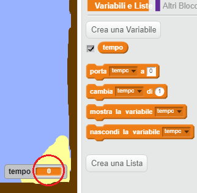

## Tempo di Prova

Ora aggiungiamo un timer al tuo gioco, in modo che il giocatore debba raggiungere l'isola deserta il più velocemente possibile.

+ Aggiungi una nuova variabile chiamata `tempo`{:class="blockdata"} al tuo quadro. Puoi anche cambiare lo schermo della tua nuova variabile. Se hai bisogno di aiuto, dai un'occhiata al progetto 'Ghostbusters'.

	

+ Aggiungi questo codice al tuo __quadro__, in modo che il timer conti il tempo che la tua barca impiega per raggiungere l'isola deserta.

	```blocks
		quando si clicca sulla bandiera verde
		porta [tempo v] a [0]
		per sempre
  			attendi (0.1) secondi
  			cambia [tempo v] di (0.1)
		end
	```

+ Ecco fatto! Prova il tuo gioco e vedi a che velocità puoi raggiungere l'isola deserta!

	
