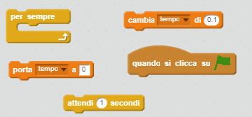
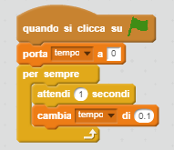

## Prova a tempo

Aggiungiamo un timer al tuo gioco, per far sì che il giocatore debba raggiungere l'isola deserta il più velocemente possibile.

+ Aggiungi una nuova variabile chiamata `tempo` ai tuoi blocchi. Puoi anche cambiare le modalità di visualizzazione della tua nuova variabile.
    
    

+ Ora aggiungi dei codici ai tuoi blocchi in modo che il timer sia attivo fino a quando la barca raggiunge l'isola deserta.

\--- hints \--- \--- hint \--- Nel blocco `quando si clicca su ⚑`, `porta tempo a 0`. All'interno del blocco `per sempre`, prima `attendi 0.1 secondi`, poi `cambia tempo di 0.1`. \--- /hint \--- \--- hint \--- Ecco di quali blocchi di codice avrai bisogno:  \--- /hint \--- \--- hint \--- Ecco come dovrebbe apparire il tuo codice:  \--- /hint \--- \--- /hints \---

+ Ecco fatto! Prova il tuo gioco e scopri quanto velocemente riesci a raggiungere l'isola deserta!
    
    
