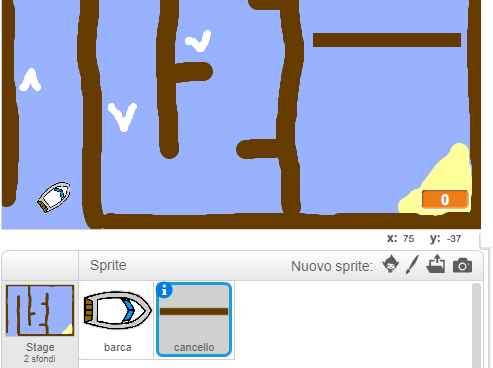

## Ostacoli e potenziamenti

Questo gioco è _davvero_troppo facile - rendiamolo più interessante.

+ Per prima cosa, aggiungiamo delle 'spinte' al tuo gioco, che accelereranno la barca. Modifica lo scenario e aggiungi alcune frecce booster bianche.

	

+ Ora puoi aggiungere dei codici al loop `per sempre`{:class="blockcontrol"} della tua barca, in modo che possa avanzare altri 3 passi quando tocca un booster bianco.

	```blocks
		se <sta toccando il colore [#FFFFFF]> allora
  			fai (3) passi
		end
	```

+ Puoi anche aggiungere una porta rotante che la tua barca deve evitare. Aggiungi un nuovo sprite chiamato 'porta', che somiglia a questo:

	

	Assicurati che il colore della porta sia lo stesso delle altre barriere di legno.

+ Imposta il centro dello sprite porta.

	

+ Aggiungi il codice alla tua porta, per farla ruotare lentamente `forever`{:class="blockcontrol"}.

+ Prova il tuo gioco. Ora avrai una porta rotante che devi evitare.

	
