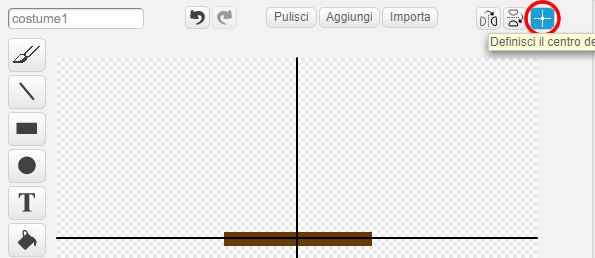

## Prova a tempo

Al momento, questo gioco è **troppo** facile: aggiungiamo qualcosina per renderlo più interessante.

In primo luogo, aggiungerai alcuni potenziamenti per accelerare la barca.

\--- task \---

Modifica lo sfondo del progetto aggiungendo alcune frecce bianche di potenziamento.


\--- /task \---

\--- task \---

Ora aggiungi altri blocchi di codice al ciclo `forever`{: class = "block3control"} in modo che lo sprite della barca si muova di tre passaggi aggiuntivi quando tocca una freccia bianca. 

```blocks3
if <touching color [#FFFFFF] ?> then
move (3) steps
end
```

\--- /task \---

\--- task \---

Prova il tuo gioco per vedere se le nuove frecce bianche velocizzano la barca.

\--- /task \---

Poi aggiungerai un cancello rotante che la barca deve evitare.

\--- task \---

Aggiungi un nuovo sprite simile a questo e chiamalo 'gate':


Assicurati che il colore del cancello sia uguale a quello delle barriere di legno.

\--- /task \---

\--- task \---

Assicurati che il centro dello sprite del cancello sia posizionato nel mezzo.



\--- /task \---

\--- task \---

Aggiungi il codice al tuo sprite per farlo ruotare lentamente per sempre.

\--- suggerimenti \--- \--- suggerimento \--- Aggiungi blocchi di codice allo sprite gate in modo che esso `giri di 1 grado` {: class = "block3motion"} `per sempre` {: Class = "block3control"}. \--- /hint \--- \--- hint \--- Qui ci sono i blocchi di codice che ti serviranno: 

```blocks3
forever
end

turn cw (1) degrees

when flag clicked
```

\--- /hint \--- \--- hint \--- Ecco come dovrebbe apparire il tuo codice: 

```blocks3
when flag clicked
forever
turn cw (1) degrees
end
```

\--- /hint \--- \--- /hints \---

\--- /task \---

\--- task \---

Prova di nuovo il tuo gioco. Ora dovresti avere un cancello rotante attorno al quale devi far virare la tua barca.


\--- /task \---