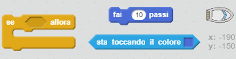
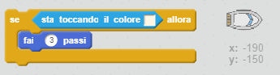
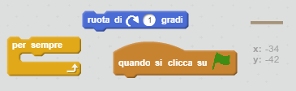
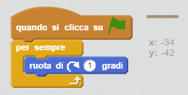

## Ostacoli e potenziamenti

Al momento, questo gioco è *troppo* facile: aggiungiamo qualcosina per renderlo più interessante.

+ Per prima cosa, aggiungiamo alcuni "potenziamenti" al tuo gioco per velocizzare la barca. Modifica lo sfondo e aggiungi alcune frecce bianche per far aumentare la velocità.
    
    

+ Ora aggiungi dei codici al circuito "per sempre" per far sì che la barca si muova di tre passi in più quando tocca una freccia bianca.

\--- hints \--- \--- hint \--- `Se` la barca `sta toccando una freccia bianca`, deve `muoversi di 3 passi`.  
\--- /hint \--- \--- hint \--- Ecco di quali blocchi di codice avrai bisogno:  \--- /hint \--- \--- hint \--- Ecco come dovrebbe apparire il tuo codice:  \--- /hint \--- \--- /hints \---

+ Puoi anche aggiungere un cancello rotante che la tua barca dovrà evitare. Aggiungi una nuova icona chiamata 'cancello', simile a questa:
    
    
    
    Assicurati che il colore del cancello sia uguale a quello delle barriere di legno.

+ Segna il centro dell'icona 'cancello'.
    
    

+ Aggiungi dei codici al tuo cancello per far sì che giri lentamente all'infinito.

\--- hints \--- \--- hint \--- Aggiungi del codice al cancello per far sì che `ruoti di 1 grado` `per sempre`. \--- /hint \--- \--- hint \--- Ecco di quali blocchi di codice avrai bisogno:  \--- /hint \--- \--- hint \--- Ecco come dovrebbe apparire il tuo codice:  \--- /hint \--- \--- /hints \---

+ Prova il tuo gioco. Ora dovresti avere un cancello rotante che devi evitare.
    
    