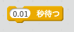
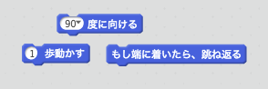
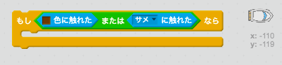

\--- challenge \---

## チャレンジ：障害物の追加！

ゲームに障害物を追加しましょう。例をいくつか示します。

\--- task \---

背景にグリーンスライムを追加し、プレーヤーがふれるとスピードダウンします。

\--- hints \--- \--- hint \--- `秒待つ`ブロックを使います。  \--- /hint \--- \--- /hints \---

\--- /task \---

\--- task \---

丸太やサメなど移動する障害物も追加できます！

\--- hints \--- \--- hint \--- これらのブロックはあなたの新しい障害物を動かすのに役立ちます：

新しいオブジェクトが茶色でない場合は、ボートのコードに追加が必要です。

 \--- /hint \--- \--- /hints \---

\--- /task \---

\--- /challenge \---