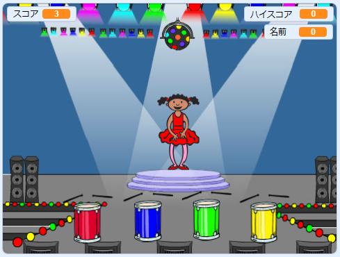

## この次は？

「ボートレース」プロジェクトの完了おめでとうございます！ もう少し難しいものに挑戦してみませんか？

[「メモリー」](https://projects.raspberrypi.org/ja-JP/projects/memory?utm_source=pathway&utm_medium=whatnext&utm_campaign=projects)プロジェクトに挑戦してみましょう。

--- no-print ---

緑の旗をクリックしてスタートします。 ダンサーのドレスの色の順番を見て、それに合わせたドラムの音を聞き、その色の順番を繰り返します。 色の順番を間違えると、ゲームオーバーになります！

  <iframe allowtransparency="true" width="485" height="402" src="//scratch.mit.edu/projects/embed/284452634/?autostart=false" frameborder="0" allowfullscreen scrolling="no" mark="crwd-mark"></iframe> 

--- /no-print ---

--- print-only ---

--- /print-only ---

***
このプロジェクトは以下のボランティアによって翻訳されました。

Tetsuya Saito

Masatoshi Ono

上田健之

Shu Hayakawa

ボランティアのおかげで、世界中の人々に母国語で学ぶ機会を与えることができます。翻訳を引き受けていただくことで、より多くの人々に手を差し伸べることができます。詳しくは rpf.io/translate をご覧ください。