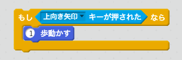

\--- challenge \---

## チャレンジ：ボートの追加！

二人のプレーヤーで競争するゲームにしてください。第2のプレイヤーは、上向きの矢印キーでを使って船を全身させ、左と右の矢印キーを使って船をターンさせます。

\--- hints \--- \--- hint \--- ボートを複製して色を変えてください。

 \--- /hint \--- \--- hint \--- 別々の場所からボートがスタートするよう、このコードを変更します

 \--- / hint \--- \--- hint \--- 「boat2」のマウスを使うコードを削除して、矢印キーで「boat2」を操作するように変更してください。 \--- /hint \--- \--- hint \--- boat2を前進させるために必要なコードです。

 \--- /hint \--- \--- hint \--- You'll also need code to *turn* the boat when the left and right arrow keys are pressed. \--- /hint \--- \--- /hints \---

\--- /challenge \---