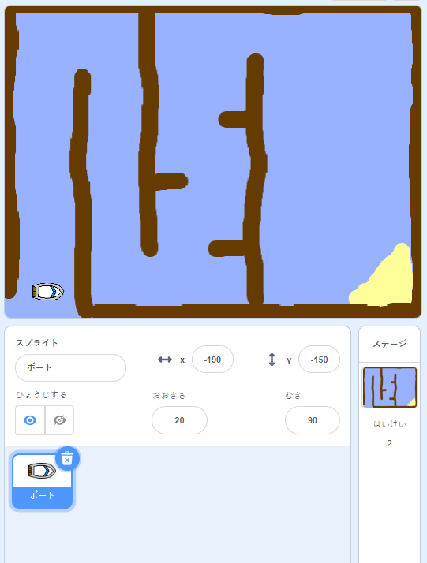

## 開始する

\--- task \---

スタータープロジェクトを開きます。

## \--- collapse \---

title: スクラッチをオンラインで使っている場合

## image: images/image.png

[ jumpto.cc/boat-go](https://scratch.mit.edu/projects/63958014/#editor){:target="_blank"}で 「ボートレース」スクラッチスタータープロジェクトを開きます。 \--- /collapse \---

## \--- collapse \---

title: スクラッチをオフラインで使っている場合

## image: images/image.png

[ jumpto.cc/boat-get](http:jumpto.cc/boat-get){:target="_blank"} から 「ボートレース」スクラッチスタータープロジェクトをダウンロードし、オフラインエディタで開きます。 \--- /collapse \---

\--- /task \---

\--- task \---

プロジェクトには、ボートのスプライトとコースの背景が含まれています。

- あなたのボートが避けなければならない木材
- あなたのボートがたどり着かなければなければならない無人島
    
    

\--- /task \---