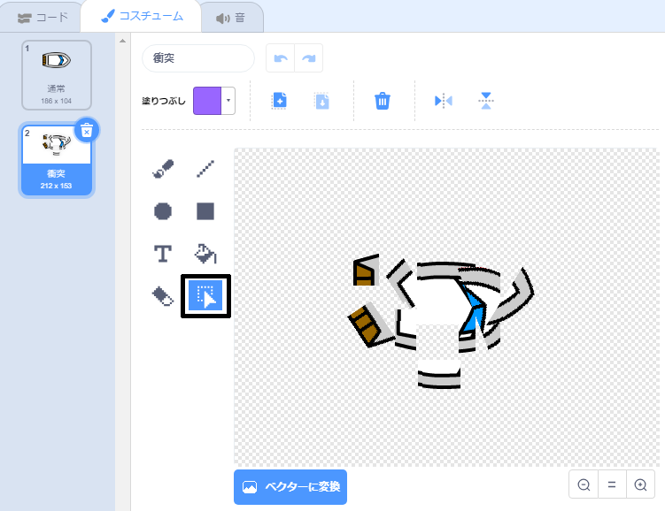

## ぶつかった！

現時点では、ボートのスプライトは木製の壁を通過してしまいます！これを修正していきましょう。

--- task ---

ボートのコスチュームとして、通常のコスチュームと衝突したときのコスチュームの２つが必要です。「boat」コスチュームを複製して一方を「通常」に、もう一方を「衝突」という名前にしてください。

--- /task ---

--- task ---

「衝突」コスチュームをクリックし、**選択**ツールでボートの一部を囲み、それらを移動させたり回転させたりして、ボートが衝突して粉々になったように見えるようにします。



--- /task ---

--- task ---

ボートにコードを追加して、茶色の木製の壁に触れるとぶつかって壊れるようにしましょう。

--- hints ---
 --- hint ---

ボートのスプライトが衝突したかどうかをコードが繰り返し確認するように`ずっと`{:class="block3control"}ループ内にコードブロックを追加する必要があります。ボートのスプライトが衝突したら、そのコードはボートのスプライトの位置を元に戻す必要があります。

`もし`{:class="block3control"}ボートが木の茶色に`触れた`{:class="block3sensing"}ら、`衝突コスチュームに切り替え`{:class="block3looks"}、`うわーーー と2秒言い`{:class="block3looks"}、`通常のコスチュームに戻ります`{:class="block3looks"}。 最後に、ボートを`上向きにし`{:class="block3motion"}、`開始位置に移動`{:class="block3motion"}する必要があります。

--- /hint --- --- hint ---

必要なコードブロックは次のとおりです。


```blocks3
もし <touching color [ ] ?> なら
end

x座標を (-190) 、y座標を (-150) にする

コスチュームを (hit v) にする

(0) 度に向ける

コスチュームを (normal v) にする

[うわーーー] と (2) 秒言う
```

--- /hint --- --- hint ---

コードは次のようになります。


```blocks3
⚑ が押されたとき
(0) 度に向ける
x座標を (-190) 、y座標を (-150) にする
ずっと 
もし <((mouse-pointer v) までの距離) > [5]> なら 
(mouse-pointer v) へ向ける
(1) 歩動かす
end
もし <touching color [#663b00] ?> なら 
コスチュームを (hit v) にする
[うわーーー] と (2) 秒言う
コスチュームを (normal v) にする
(0) 度に向ける
x座標を (-190) 、y座標を (-150) にする
end
```

--- /hint ------ /hints ---

--- /task ---

--- task ---

また、ボートのスプライトがいつも「通常」コスチュームから始まるようにするコードも追加しなければなりません。

コードをもう一度テストします。木製の壁を越えてボートを移動させようとすると、ボートはクラッシュし、開始位置に戻るはずです。


--- /task ---