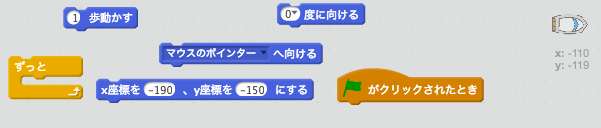
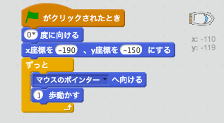
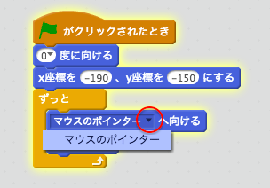
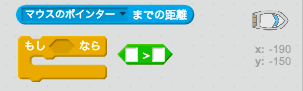
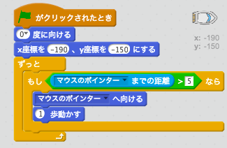

## ボートの制御

\--- task \---

マウスでボートをコントロールします。 強調された左下隅からマウスポインタをたどるように、ボートにコードを追加します。 期待どおりに動くか**コードをテストして**確認しましょう。

\--- hints \--- \--- hint \--- `緑の旗 がクリックされたら`ボートを `スタート地点` に移動させて `上向き` にする必要があります。 次に、`マウスポインタの方向を向かせ`て` 1ステップ移動する`必要があります 。 これを `永遠に` 繰り返す必要があります。

\--- /hint \--- \--- hint \--- 必要になるコードブロックはこちらです。  \--- /hint \--- \--- hint \--- コードの見本はこちらです。  \--- /hint \--- \--- /hints \---

\--- /task \---

\--- task \---

旗をクリックしてマウスを動かし、ボートをテストしてください。ボートはマウスに向かって航行しますか？

## \--- collapse \---

title: 問題がある場合 ...

## image: images/image.png

**Note:** 現在、スクラッチにはバグがあり、ボートがマウスポインターに向かって付いてこなくなることがあります。 このような場合は、`マウスのポインターへ向ける`というブロックの`マウスのポインター`をもう一度えらんでください。

 \--- /collapse \---

\--- /task \---

\--- task \---

ボートがマウスポインタに達するとどうなりますか？それを試してみてください。

\--- /task \---

\--- task \---

そうならないように、コードに`もし…なら`のブロックを入れて、ボートがマウスから5ピクセルはなれた時だけ動くようにしましょう。

\--- hints \--- \--- hint \--- ボートは`もし…なら`で、`マウスポインターまでの距離`が`が5ピクセルより大きい` 時だけ、マウスポインターの方向を向いて移動しなければなりません \--- /hint \--- \--- hint \--- 必要になるコードブロックはこちらです。  \--- /hint \--- \--- hint \--- コードの見本はこちらです。  \--- /hint \--- \--- /hints \---

\--- /task \---

\--- task \---

ボートをもう一度試して、問題が修正されているかどうかを確認ましょう。

\--- /task \---