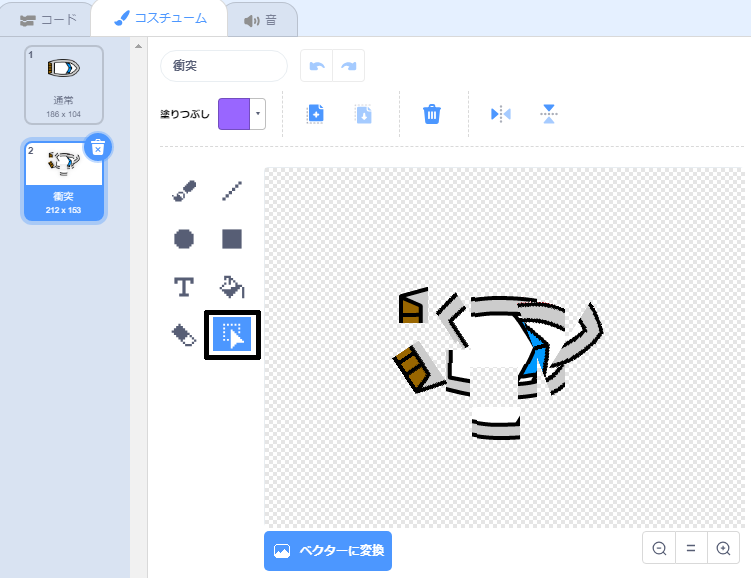
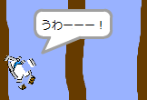

## ぶつかった！

現時点では、ボートのスプライトは木製の壁を通過してしまいます！これを修正していきましょう。

--- task ---

ボートのコスチュームとして、通常のコスチュームと衝突したときのコスチュームの２つが必要です。「boat」コスチュームを複製して一方を「通常」に、もう一方を「衝突」という名前にしてください。

--- /task ---

--- task ---

「衝突」コスチュームをクリックし、**選択**ツールでボートの一部を囲み、それらを移動させたり回転させたりして、ボートが衝突して粉々になったように見えるようにします。



--- /task ---

--- task ---

ボートにコードを追加して、茶色の木製の壁に触れるとぶつかって壊れるようにしましょう。

--- hints ---
 --- hint ---

ボートのスプライトが衝突したかどうかをコードが繰り返し確認するように`ずっと`{:class="block3control"}ループ内にコードブロックを追加する必要があります。ボートのスプライトが衝突したら、そのコードはボートのスプライトの位置を元に戻す必要があります。

`もし`{:class="block3control"}ボートが木の茶色に`触れた`{:class="block3sensing"}ら、`衝突コスチュームに切り替え`{:class="block3looks"}、`うわーーー と2秒言い`{:class="block3looks"}、`通常のコスチュームに戻ります`{:class="block3looks"}。 最後に、ボートを`上向きにし`{:class="block3motion"}、`開始位置に移動`{:class="block3motion"}する必要があります。

--- /hint --- --- hint ---

必要なコードブロックは次のとおりです。


```blocks3
if <touching color [ ] ?> then
end

go to x: (-190) y: (-150)

switch costume to (衝突 v)

point in direction (0)

switch costume to (通常 v)

say [うわーーー] for (2) seconds
```

--- /hint ---
--- hint ---

コードは次のようになります。


```blocks3
when flag clicked
point in direction (0)
go to x: (-190) y: (-150)
forever
if <(distance to (マウスのポインター v)) > [5]> then 
point towards (マウスのポインター v)
move (1) steps
end
if <touching color [#663b00] ?> then 
switch costume to (衝突 v)
say [うわーーー] for (2) seconds
switch costume to (通常 v)
point in direction (0)
go to x: (-190) y: (-150)
end
```

--- /hint ---

--- /hints ---

--- /task ---

--- task ---

また、ボートのスプライトがいつも「通常」コスチュームから始まるようにするコードも追加しなければなりません。

コードをもう一度テストします。木製の壁を越えてボートを移動させようとすると、ボートはクラッシュし、開始位置に戻るはずです。



--- /task ---