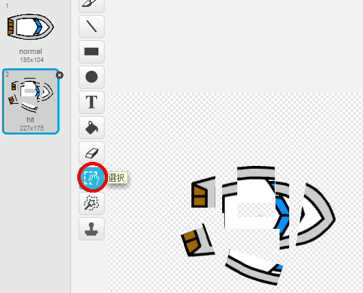
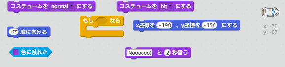
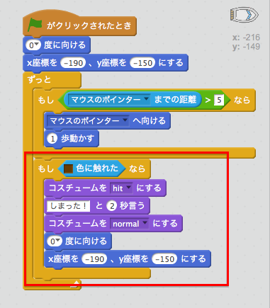
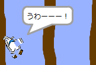

## クラッシュ！

現時点では、ボートは木の障害物を通りぬけることができてしまいます！直してみましょう。

+ ボートのコスチュームとして、普通のコスチュームとクラッシュしたときのコスチュームが必要になります。「boat」コスチュームを複製して一方を「normal」に、もう一方を「hit」という名前にしてください。

+ 「hit」コスチュームをクリックし、「選択」ツールを使ってボートのいろいろな部分をつまんで、動かしたり回したりしてボートがこわれているようにしてください。
    
    

+ これからボートにコードを追加して、茶色の木の部分に触れるとクラッシュして壊れるようにしましょう。

\--- hints \--- \--- hint \--- ボートの`ずっと`ループ内にボートがクラッシュするかチェックしつづけるコードを追加するします。 `もし`ボートが木の茶色に`触れた`ら`コスチュームを「hit」に`して`Noooooo! for 2 seconds`, and then `switch back to the normal costume`. Finally, you'll need to `point up` and `go to the start position`. \--- /hint \--- \--- hint \--- Here are the code blocks you'll need:  \--- /hint \--- \--- hint \--- Here's what your code should look like:  \--- /hint \--- \--- /hints \---

+ You should also make sure that your boat always starts out looking 'normal'.
    
    If you try to sail through a wooden barrier now, you should see that your boat crashes and moves back to the start.
    
    