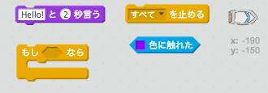
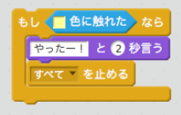

## チャレンジ：ゴール!

もう一つ `もし…なら`ブロックを使って、ボートが島についたらゴールにしましょう。

ボートが無人島についたら、「やったー！」と言ってゲームが止まるようにします。

\--- hints \--- \--- hint \--- ボートの`ずっと`ループ内にプレイヤーがゴールするかチェックしつづけるコードを追加するします。 `もし`ボートが宝島の色に`触れた`なら`2秒間「やったー！」と言って``すべてを停止`してゲームを終了するようにします。 \--- /hint \--- \--- hint \--- 必要になるコードブロックはこちらです。  \--- /hint \--- \--- hint \--- コードの見本はこちらです。 

新しいコードは`ずっと` ループの中に追加することを忘れずに。 \--- /hint \--- \--- /hints \---