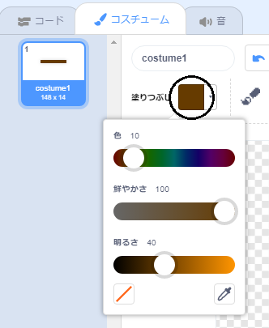

## 障害物とブースター

今のままではゲームは**とても**簡単すぎるので、いろいろつけ足してもっとおもしろくしましょう。

最初に、ボートをスピードアップするためのブースターを追加します。

\--- task \---

白いブースター矢印を追加して、ステージの背景を編集します。


\--- /task \---

\--- task \---

ボートの`ずっと` {：class = "block3control"}ループにさらにコードブロックを追加して、ボートのスプライトが白い矢印に触れたときに、もう3歩動くようにします。 

```blocks3
もし <[#FFFFFF] 色に触れた> なら 
  (3) 歩動かす
end
```

\--- /task \---

\--- task \---

ゲームをテストして、新しいブースター矢印がボートを加速するかどうかを確認します。

\--- /task \---

次に、ボートが避けなければならない回転ゲートを追加します。

\--- task \---

次のような新しいスプライトを追加し、「ゲート」という名前を付けます。


ゲートスプライトの色が木の障壁の色と同じであることを確認してください。



\--- /task \---

\--- task \---

ゲートスプライトの中心が中央に配置されていることを確認します。


\--- /task \---

\--- task \---

ゲートスプライトにコードを追加して、ゆっくりとずっと回転するようにします。

\--- hints \--- \--- hint \--- ゲートスプライトにコードブロックを追加して、ゲートが `ずっと`{:class="block3control"}`1度回る`{:class="block3motion"}.ようにします。 \--- /hint \--- \--- hint \--- 必要なコードブロックは次のとおりです。 

```blocks3
ずっと
end

↻ (1) 度回す

⚑ が押されたとき
```

\--- /hint \--- \--- hint \--- コードは次のようになります： 

```blocks3
⚑ が押されたとき
ずっと 
  ↻ (1) 度回す
end
```

\--- /hint \--- \--- /hints \---

\--- /task \---

\--- task \---

ゲームをもう一度テストします。これで、ボートをひっかき回す回転ゲートができました。


\--- /task \---