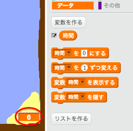
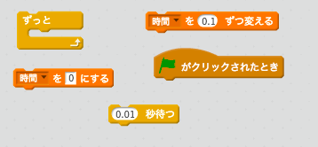
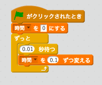
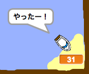

## タイムトライアル

プレーヤーができるだけ早く砂漠の島に着くように、ゲームにタイマーを追加しましょう。

\--- task \---

「ステージ」に新しい変数`time`を追加しましょう。この変数の表示を変える事もできます。

[[[generic-scratch-add-variable]]]

\--- /task \---

\--- task \---

砂漠の島に到着するまでかかった時間を計れるように、ステージにコードを追加します。

\--- hints \--- \--- hint \--- ステージで、`緑の旗がクリックされたとき`に、`時間を0に設定します`。 `ずっと`ブロックの中では、最初に`0.1秒まで待ち`、それから`時間を0.1変更する`ようにします。 \--- /hint \--- \--- hint \--- 必要になるコードブロックはこちらです。  \--- /hint \--- \--- hint \--- コードの見本はこちらです。  \--- /hint \--- \--- /hints \---

\--- /task \---

\--- task \---

できあがりです！どれくらい早く無人島に着けるか、ためしてみましょう！

\--- /task \---