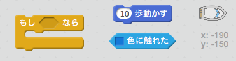
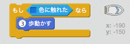
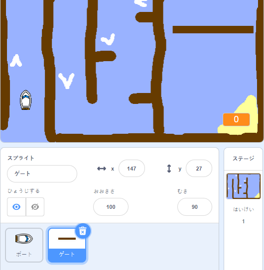
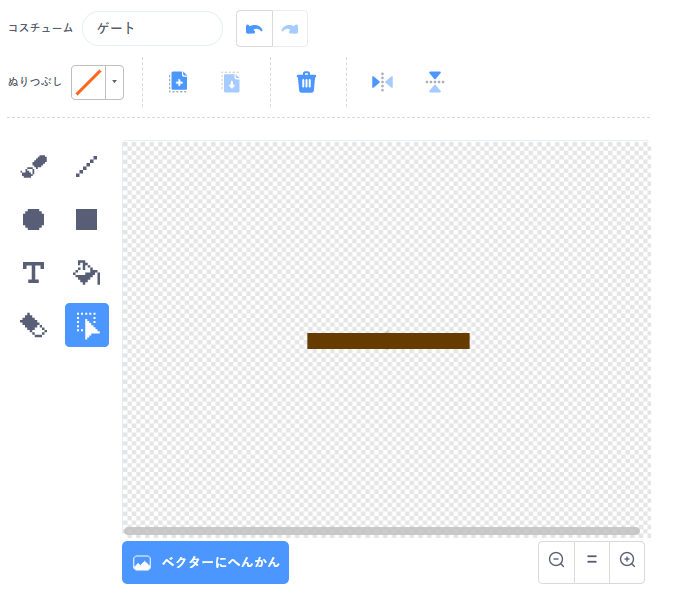
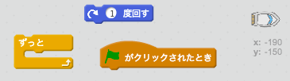
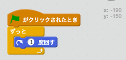
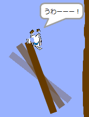

## 動くかべとスピードアップ

まだまだゲームはかんたん*すぎる*ので、いろいろつけ足してもっとおもしろくしましょう。

\--- task \---

ボートをスピードアップするためにゲームにいくつかの「ブースト」を追加しましょう。ステージの背景を編集し、白いブースターの矢印を追加します。

\--- /task \---

\--- task \---

白い「ブースト」に触れたら3歩よぶんに進むように「ずっと」ループにコードを追加します。

\--- hints \--- \--- hint \--- `もし`ボートが`白いスピードアップに触れた`なら、`3歩動かす`ようにします。  
\--- /hint \--- \--- hint \--- 必要になるコードブロックはこちらです。  \--- /hint \--- \--- hint \--- コードの見本はこちらです。  \--- /hint \--- \--- /hints \---

\--- /task \---

\--- task \---

ボートが避けなければならない回転するゲートを追加することもできます。次のような「gate」という新しいスプライトを追加します。

ゲートの色と木の障害物の色が同じ茶色であることをたしかめましょう。

\--- /task \---

\--- task \---

ゲートスプライトを中心にセットしてください。

\--- /task \---

\--- task \---

ずっとゆっくり回転するようにコードをゲートに追加します。

\--- hints \--- \--- hint \--- `ずっと``1度回す`というようなコードをゲートスプライトに追加します。 \--- /hint \--- \--- hint \--- 必要になるコードブロックはこちらです。  \--- /hint \--- \--- hint \--- コードの見本はこちらです。  \--- /hint \--- \--- /hints \---

\--- /task \---

\--- task \---

ゲームをテストしましょう。避けるなければならない回転するゲートが現れるはずです。

\--- /task \---