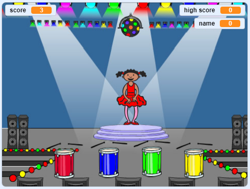

## ಮುಂದೆ ಏನು?

'ದೋಣಿ ಓಟದ ಸ್ಪರ್ಧೆ' ಯೋಜನೆಯನ್ನು ಪೂರ್ಣಗೊಳಿಸಿದ್ದಕ್ಕಾಗಿ ಅಭಿನಂದನೆಗಳು! ಸ್ವಲ್ಪ ಹೆಚ್ಚು ಸವಾಲಿನ ಯಾವುದನ್ನಾದರೂ ಪ್ರಯತ್ನಿಸಲು ನೀವು ಬಯಸುವಿರಾ?

ನೀವು [ಮೆಮೊರಿ](https://projects.raspberrypi.org/kn-IN/projects/memory?utm_source=pathway&utm_medium=whatnext&utm_campaign=projects) ಯೋಜನೆಯನ್ನು ಪ್ರಯತ್ನಿಸಬಹುದು.

--- no-print ---

ಪ್ರಾರಂಭಿಸಲು ಹಸಿರು ಧ್ವಜದ ಮೇಲೆ ಒತ್ತಿರಿ. ನರ್ತಕಿಯ ಉಡುಗೆಯ ಬಣ್ಣಗಳ ಅನುಕ್ರಮವನ್ನು ವೀಕ್ಷಿಸಿ ಮತ್ತು ಜೊತೆಯಲ್ಲಿರುವ ಡ್ರಮ್ ಬೀಟ್‌ಗಳನ್ನು ಆಲಿಸಿ, ನಂತರ ಬಣ್ಣಗಳನ್ನು ಅವಳಿಗೆ ಪುನರಾವರ್ತಿಸಿ. ನೀವು ಬಣ್ಣಗಳ ಕ್ರಮವನ್ನು ತಪ್ಪಾಗಿ ಪಡೆದರೆ, ಆಟ ಮುಗಿದಿದೆ!

  <iframe allowtransparency="true" width="485" height="402" src="//scratch.mit.edu/projects/embed/284452634/?autostart=false" frameborder="0" allowfullscreen scrolling="no" mark="crwd-mark"></iframe> 

--- /no-print ---

--- print-only ---

--- /print-only ---

***
ಈ ಯೋಜನೆಯನ್ನು ಸ್ವಯಂಸೇವಕರು ಅನುವಾದಿಸಿದ್ದಾರೆ:

Pradeep Kaushik

Vasu

Shreya

ಸ್ವಯಂಸೇವಕರಿಗೆ ಧನ್ಯವಾದಗಳು, ನಾವು ಪ್ರಪಂಚದಾದ್ಯಂತದ ಜನರಿಗೆ ತಮ್ಮ ಸ್ವಂತ ಭಾಷೆಯಲ್ಲೇ ಕಲಿಯಲು ಅವಕಾಶ ನೀಡಬಹುದು. ಹೆಚ್ಚಿನ ಜನರನ್ನು ತಲುಪಲು, ನೀವು ಅನುವಾದಿಸಲು ಸ್ವಯಂಸೇವಕರಾಗಿ, ನಮಗೆ ಸಹಾಯ ಮಾಡಬಹುದು - [rpf.io/translate](https://rpf.io/translate) ನಲ್ಲಿ ಹೆಚ್ಚಿನ ಮಾಹಿತಿ.