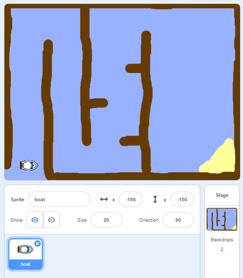

## ಪ್ರಾರಂಭವಾಗುತ್ತಿದೆ

\--- task \---

ಸ್ಟಾರ್ಟರ್ ಯೋಜನೆಯನ್ನು ತೆರೆಯಿರಿ.

**Online:** [rpf.io/boat-race-starter-on](http://rpf.io/boat-race-starter-on){:target="_blank"} ನಲ್ಲಿ ಆನ್‌ಲೈನ್ ಸ್ಟಾರ್ಟರ್ ಯೋಜನೆಯನ್ನು ತೆರೆಯಿರಿ.

ನೀವು Scratch ಖಾತೆಯನ್ನು ಹೊಂದಿದ್ದರೆ **Remix** ಮಾಡುವ ಮೂಲಕ ನೀವು ಪ್ರತಿಕೃತಿಯನ್ನು ಮಾಡಬಹುದು.

** Offline: ** [ rpf.io/p/en/boat-race-go ನಿಂದ ಆಫ್‌ಲೈನ್ ಸ್ಟಾರ್ಟರ್ ಯೋಜನೆಯನ್ನು ಡೌನ್‌ಲೋಡ್ ಮಾಡಿ ](http://rpf.io/p/en/boat-race-go) {: target= "_ blank"}, ನಂತರ ಅದನ್ನು ಆಫ್‌ಲೈನ್ ಪರಿಷ್ಕರಣೆಯನ್ನು ಬಳಸಿ ತೆರೆಯಿರಿ.

ನೀವು ಸ್ಕ್ರ್ಯಾಚ್ ಆಫ್‌ಲೈನ್ ಸಂಪಾದಕವನ್ನು ಡೌನ್‌ಲೋಡ್ ಮಾಡಿ ಸ್ಥಾಪಿಸಬೇಕಾದರೆ, ನೀವು ಅದನ್ನು [ rpf.io/scratchoff ನಲ್ಲಿ ಕಾಣಬಹುದು ](http://rpf.io/scratchoff) .

\--- /task \---

\--- task \---

ಯೋಜನೆಯು ದೋಣಿ sprite ಓಟದ ಹಾದಿಯ ಹಿನ್ನೆಲೆಯನ್ನು ಒಳಗೊಂಡಿದೆ:

- ದೋಣಿ sprite ಪ್ಪಿಸಬೇಕಾದ ಮರದ ದಿಮ್ಮಿ 
- ದೋಣಿ ತಲುಪಬೇಕಾದ ಮರುಭೂಮಿ ದ್ವೀಪ
    
    

\--- /task \---