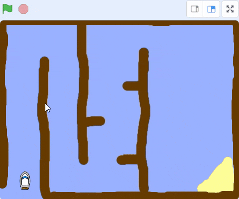

## ದೋಣಿಯನ್ನು ನಿಯಂತ್ರಿಸುವುದು

\--- task \---

Add this code to the boat sprite so that it starts in the bottom left-hand corner pointing up and then follows the mouse pointer.


```blocks3
when flag clicked
point in direction (0)
go to x: (-190) y: (-150)
forever
point towards (mouse-pointer v)
move (1) steps
```

\--- /task \---

\--- task \---

ಹಸಿರು ಧ್ವಜವನ್ನು ಕ್ಲಿಕ್ ಮಾಡಿ ಮೌಸ್ ಅನ್ನು ಚಲಿಸುವ ಮೂಲಕ**ನಿಮ್ಮ ಕೋಡ್ ಅನ್ನು ಪರೀಕ್ಷಿಸಿ** ದೋಣಿ sprite ಮೌಸ್ ಪಾಯಿಂಟರ್ ಕಡೆಗೆ ಚಲಿಸುತ್ತದೆಯೇ?


\--- no-print \---



\--- /no-print \---

\--- print-only \---


\--- /print-only \---

\--- /task \---

\--- task \---

ದೋಣಿ ಮೌಸ್ ಪಾಯಿಂಟರ್ ತಲುಪಿದಾಗ ಏನಾಗುತ್ತದೆ? ಸಮಸ್ಯೆ ಏನೆಂದು ನೋಡಲು ಇದನ್ನು ಪ್ರಯತ್ನಿಸಿ.

\--- /task \---

\--- task \---

Add code to the boat sprite so it only point towards the mouse pointer and moves `if`{:class="block3control"} the `distance to the mouse pointer`{:class="block3sensing"} is `greater than 5 pixels`{:class="block3operators"}.

```blocks3
when flag clicked
point in direction (0)
go to x: (-190) y: (-150)
forever
+if <(distance to (mouse-pointer v)) > [5]> then
point towards (mouse-pointer v)
move (1) steps
```

\--- /task \---

\--- task \---

ಈಗ ಸಮಸ್ಯೆ ಪರಿಹರಿಸಲಾಗಿದೆಯೆ ಎಂದು ಪರಿಶೀಲಿಸಲು ನಿಮ್ಮ ಕೋಡ್ ಅನ್ನು ಮತ್ತೆ ಪರೀಕ್ಷಿಸಿ.

\--- /task \---