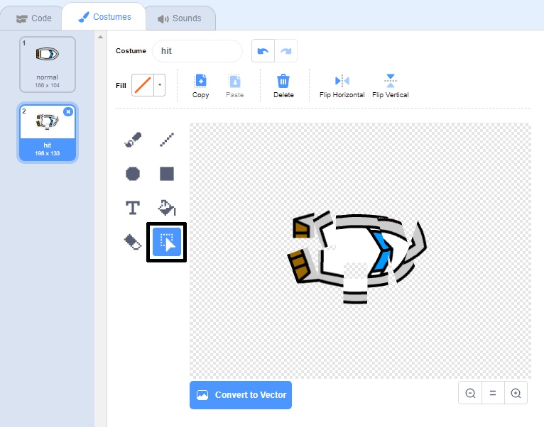

## ಅಪ್ಪಳಿಸುವುದು!

ಈ ಸಮಯದಲ್ಲಿ, ದೋಣಿ sprite ಮರದ ದಿಮ್ಮಿಯ ಅಡೆತಡೆಗಳ ಮೂಲಕ ಸುಮ್ಮನೆ ಸಾಗಬಹುದು! ನೀವು ಈಗ ಅದನ್ನು ಸರಿಪಡಿಸಲು ಹೊರಟಿದ್ದೀರಿ.

\--- task \---

ನಿಮ್ಮ ದೋಣಿ sprite‌ಗಾಗಿ ನಿಮಗೆ ಎರಡು ವೇಷಭೂಷಣಗಳು ಬೇಕಾಗುತ್ತವೆ: ಒಂದು ಸಾಮಾನ್ಯ ವೇಷಭೂಷಣ, ಮತ್ತು ದೋಣಿ ಅಪಘಾತಕ್ಕೀಡಾದಾಗ ಒಂದು. ನಿಮ್ಮ ದೋಣಿ sprite‌ನ ಉಡುಪಿನ ಪ್ರತಿಕೃತಿ ಮಾಡಿ, ಮತ್ತು ಒಂದು ವೇಷಭೂಷಣವನ್ನು 'ಸಾಮಾನ್ಯ' ಮತ್ತು ಇನ್ನೊಂದನ್ನು 'ಹಿಟ್' ಎಂದು ಹೆಸರಿಸಿ.

\--- /task \---

\--- task \---

ನಿಮ್ಮ 'ಹಿಟ್' ಉಡುಪಿನ ಮೇಲೆ ಕ್ಲಿಕ್ ಮಾಡಿ, ಮತ್ತುಅವುಗಳನ್ನು ಸರಿಸಿ ತಿರುಗಿಸುತ್ತಾ ವಸ್ತ್ರದ ತುಣುಕುಗಳನ್ನು ಹಿಡಿಯಲು ಮತ್ತು ದೋಣಿ ತುಂಡುಗಳಾಗಿ ಅಪ್ಪಳಿಸಿದಂತೆ ಕಾಣಲು **select** ಸಾಧನ ಬಳಸಿ.



\--- /task \---

\--- task \---

ಈಗ ನಿಮ್ಮ ದೋಣಿಗೆ ಕೋಡ್ ಸೇರಿಸಿ ಇದರಿಂದ ಅದು ಯಾವುದೇ ಕಂದು ಬಣ್ಣದ ಮರದ ಅಡೆತಡೆಗಳನ್ನು ಮುಟ್ಟಿದಾಗ ಅದು ಅಪ್ಪಳಿಸುತ್ತದೆ ಮತ್ತು ಅದನ್ನುಒಡೆಯುತ್ತದೆ.

\--- hints \--- \--- hint \---

ನೀವು ಕೋಡ್ ಬ್ಲಾಕ್ಗಳನ್ನು`forever`{:class="block3control"} ಲೂಪ್ ಒಳಗೆ ಸೇರಿಸುವ ಅಗತ್ಯವಿದೆ ಆದ್ದರಿಂದ ನಿಮ್ಮ ಕೋಡ್ ದೋಣಿ sprite ಕ್ರ್ಯಾಶ್ ಆಗಿದೆಯೇ ಯಂದು ಪರೀಕ್ಷಿಸಿ ಮತ್ತು ಅದು ಕ್ರ್ಯಾಶ್ ಆಗಿದ್ದರೆ, ಕೋಡ್ ದೋಣಿ spriteನ ಸ್ಥಾನವನ್ನು ಪುನಃ ಸಂಯೋಜಿಸುವ ಅಗತ್ಯವಿದೆ.

`if`{:class="block3control"} ದೋಣಿ `ಸ್ಪರ್ಶಿಸುವುದು`{:class="block3sensing"} ಮರದ ಕಂದು ಬಣ್ಣ, ನೀವು `ಹಿಟ್ ಉಡುಪಿಗೆ ಬದಲಿಸಿ`{:class="block3looks"}, `say Noooo! ಅಗತ್ಯವಿದೆ! 2 ಸೆಕೆಂಡುಗಳ ಕಾಲ`{:class="block3looks"}, ತದನಂತರ `ಸಾಮಾನ್ಯ ಉಡುಪಿಗೆ ಹಿಂತಿರುಗಿ`{:class="block3looks"}. ಅಂತಿಮವಾಗಿ, ನೀವು `ಮೇಲಕ್ಕೆ ಸೂಚಿಸುವ ಅಗತ್ಯವಿದೆ`{:class="block3motion"} ಮತ್ತು `ಪ್ರಾರಂಭದ ಸ್ಥಾನಕ್ಕೆ ಹೋಗಿ`{:class = "block3motion"}.

\--- /hint \--- \--- hint \---

ನಿಮಗೆ ಅಗತ್ಯವಿರುವ ಕೋಡ್ ಬ್ಲಾಕ್‌ಗಳು ಇಲ್ಲಿವೆ:


```blocks3
if <touching color [ ] ?> then
end

go to x: (-190) y: (-150)

switch costume to (hit v)

point in direction (0)

switch costume to (normal v)

say [Noooooo!] for (2) seconds
```

\--- /hint \--- \--- hint \---

ನಿಮ್ಮ ಕೋಡ್ ಹೀಗಿರಬೇಕು:


```blocks3
when flag clicked
point in direction (0)
go to x: (-190) y: (-150)
forever
if <(distance to (mouse-pointer v)) > [5]> then
point towards (mouse-pointer v)
move (1) steps
end
if <touching color [#663b00] ?> then
switch costume to (hit v)
say [Noooooo!] for (2) seconds
switch costume to (normal v)
point in direction (0)
go to x: (-190) y: (-150)
end
```

\--- /hint \--- \--- /hints \---

\--- /task \---

\--- task \---

ನಿಮ್ಮ ದೋಣಿ sprite ಯಾವಾಗಲೂ 'ಸಾಮಾನ್ಯ' ಆಗಿ ಕಾಣುತ್ತದೆ ಎಂದು ಖಚಿತಪಡಿಸಿಕೊಳ್ಳಲು ನೀವು ಕೋಡ್ ಅನ್ನು ಕೂಡ ಸೇರಿಸಬೇಕು.

ನಿಮ್ಮ ಕೋಡ್ ಅನ್ನು ಮತ್ತೆ ಪರೀಕ್ಷಿಸಿ. ನೀವು ಈಗ ಮರದ ತಡೆಗೋಡೆ ಮೂಲಕ ದೋಣಿಯನ್ನು ಸಾಗಿಸಲು ಪ್ರಯತ್ನಿಸಿದರೆ, ದೋಣಿ ಅಪಘಾತಕ್ಕೀಡಾಗಿ ನಂತರ ಅದರ ಆರಂಭಿಕ ಸ್ಥಾನಕ್ಕೆ ಹಿಂತಿರುಗಬೇಕು.


\--- /task \---