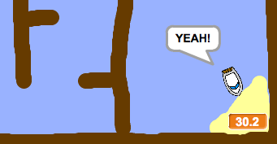

## ಟೈಮರ್ ಅನ್ನು ಸೇರಿಸುವ ವಿಧಾನ

ಆಟಗಾರನು ಆದಷ್ಟು ಬೇಗ ದ್ವೀಪಕ್ಕೆ ತಲುಪಲು, ಈಗ ನೀವು ನಿಮ್ಮ ಆಟಕ್ಕೆ ಟೈಮರ್ ಅನ್ನು ಸೇರಿಸುತ್ತೀರಿ.

\--- task \---

`time`{:class="block3variables"} ಎಂಬ ಹೊಸ ವೇರಿಯಬಲ್ ಅನ್ನು ರಚಿಸಿ.


[[[generic-scratch3-add-variable]]]

ನಿಮ್ಮ ಹೊಸ ವೇರಿಯಬಲ್ ಅನ್ನು ಹೇಗೆ ಪ್ರದರ್ಶಿಸಲಾಗುತ್ತದೆ ಎಂಬುದನ್ನು ಬದಲಾಯಿಸುವ ಮೂಲಕ ನಿಮ್ಮ ಟೈಮರ್‌ಗಾಗಿ ಒಂದು ನೋಟವನ್ನು ಸಹ ನೀವು ಆಯ್ಕೆ ಮಾಡಬಹುದು.

\--- /task \---

\--- task \---

ಈಗ ನಿಮ್ಮ ಹಂತಕ್ಕೆ ಕೋಡ್ ಬ್ಲಾಕ್‌ಗಳನ್ನು ಸೇರಿಸಿ ಇದರಿಂದ ದೋಣಿ ದ್ವೀಪವನ್ನು ತಲುಪುವವರೆಗೆ ಟೈಮರ್ ಎಣಿಕೆ ಮಾಡುತ್ತದೆ.

\--- hints \--- \--- hint \---

ಹಂತದಲ್ಲಿ, `when the green flag is clicked`{:class="block3control"}, `set the time to 0`{:class="block3variables"}. ನಿಮ್ಮ `forever`{:class="block3control"} ಲೂಪ್ ಒಳಗೆ, ನೀವು ಮೊದಲು `wait 0.1 secs`{:class="block3control"}, ನಂತರ `change the time by 0.1`{:class="block3variables"}.

\--- /hint \--- \--- hint \---

ನಿಮಗೆ ಅಗತ್ಯವಿರುವ ಕೋಡ್ ಬ್ಲಾಕ್‌ಗಳು ಇಲ್ಲಿವೆ:


```blocks3
change [time v] by (0.1)

when flag clicked

forever
end

wait (0.1) seconds

set [time v] to [0]
```

\--- /hint \--- \--- hint \---

ನಿಮ್ಮ ಹೊಸ ಕೋಡ್ ಹೀಗಿರಬೇಕು:


```blocks3
when flag clicked
set [time v] to [0]
forever
wait (0.1) seconds
change [time v] by (0.1)
end
```

\--- /hint \--- \--- /hints \---

\--- /task \---

\--- task \---

ನಿಮ್ಮ ಆಟವನ್ನು ಪರೀಕ್ಷಿಸಿ ಮತ್ತು ನೀವು ದೋಣಿಯನ್ನು ಎಷ್ಟು ಬೇಗನೆ ದ್ವೀಪಕ್ಕೆ ತಲುಪಿಸಬಹುದು ಎಂಬುದನ್ನು ನೋಡಿ!



\--- /task \---