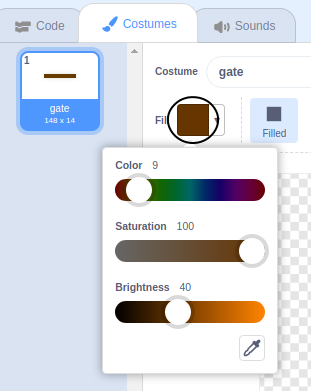

## ಅಡೆತಡೆಗಳು ಮತ್ತು ಬೂಸ್ಟರ್‌ಗಳು

ಇದೀಗ ಆಟವು **far** ಸುಲಭವಾಗಿದೆ, ಆದ್ದರಿಂದ ನೀವು ಅದನ್ನು ಇನ್ನಷ್ಟು ಆಸಕ್ತಿದಾಯಕವಾಗಿಸಲು ಕೆಲವು ವಿಷಯಗಳನ್ನು ಸೇರಿಸುತ್ತೀರಿ.

ಮೊದಲಿಗೆ, ದೋಣಿ ವೇಗಗೊಳಿಸಲು ನೀವು ಕೆಲವು ಬೂಸ್ಟರ್‌ಗಳನ್ನು ಸೇರಿಸುತ್ತೀರಿ.

--- task ---

ಕೆಲವು ಬಿಳಿ ಬೂಸ್ಟರ್ ಬಾಣಗಳನ್ನು ಸೇರಿಸುವ ಮೂಲಕ ನಿಮ್ಮ ಹಂತದ ಹಿನ್ನೆಲೆಯನ್ನು ಎಡಿಟ್ ಮಾಡಿ.


--- /task ---

--- task ---

ಈಗ ನಿಮ್ಮ ದೋಣಿಯ `forever`{:class="block3control"} ಲೂಪ್ ಸೇರಿಸಿ ಆದ್ದರಿಂದ ದೋಣಿ sprite ಬಿಳಿ ಬಾಣವನ್ನು ಮುಟ್ಟಿದಾಗ ಮೂರು ಹೆಚ್ಚುವರಿ ಹಂತಗಳನ್ನು ಚಲಿಸುತ್ತದೆ.


```blocks3
if <touching color [#FFFFFF] ?> then
move (3) steps
end
```

--- /task ---

--- task ---

ನಿಮ್ಮ ಹೊಸ ಬೂಸ್ಟರ್ ಬಾಣಗಳು ದೋಣಿಯನ್ನು ವೇಗಗೊಳಿಸುತ್ತದೆಯೇ ಎಂದು ನೋಡಲು ನಿಮ್ಮ ಆಟವನ್ನು ಪರೀಕ್ಷಿಸಿ.

--- /task ---

ಮುಂದೆ ನೀವು ದೋಣಿ ತಪ್ಪಿಸಬೇಕಾದ ನೂಲುವ ಗೇಟ್ ಅನ್ನು ಸೇರಿಸುತ್ತೀರಿ.

--- task ---

ಈ ರೀತಿ ಕಾಣುವ ಹೊಸ sprite ಅನ್ನು ಸೇರಿಸಿ ಮತ್ತು ಅದನ್ನು 'gate' ಎಂದು ಕರೆಯಿರಿ:


ಗೇಟ್ sprite ಬಣ್ಣವು ಮರದ ದಿಮ್ಮಿಗಳ ಅಡೆತಡೆಗಳ ಬಣ್ಣಕ್ಕೆ ಸಮನಾಗಿರುತ್ತದೆ ಎಂದು ಖಚಿತಪಡಿಸಿಕೊಳ್ಳಿ.



--- /task ---

--- task ---

ಗೇಟ್ sprite ಮಧ್ಯಭಾಗವು ಮಧ್ಯದಲ್ಲಿದೆ ಎಂದು ಖಚಿತಪಡಿಸಿಕೊಳ್ಳಿ.


--- /task ---

--- task ---

ನಿಮ್ಮ ಗೇಟ್ sprite ಶಾಶ್ವತವಾಗಿ ತಿರುಗುವಂತೆ ಕೋಡ್ ಸೇರಿಸಿ.

--- hints ---
 --- hint ---

ಗೇಟ್ code blocks ಗಳನ್ನು ಸೇರಿಸಿ ಇದರಿಂದ `turns 1 degree`{:class="block3motion"} `forever`{:class="block3control"}.

--- /hint --- --- hint ---

ನಿಮಗೆ ಅಗತ್ಯವಿರುವ code blocks ಗಳು ಇಲ್ಲಿವೆ:


```blocks3
forever
end

turn cw (1) degrees

when flag clicked
```

--- /hint --- --- hint ---

ನಿಮ್ಮ code ಹೀಗಿರಬೇಕು:


```blocks3
when flag clicked
forever
turn cw (1) degrees
end
```

--- /hint ------ /hints ---

--- /task ---

--- task ---

ನಿಮ್ಮ ಆಟವನ್ನು ಮತ್ತೆ ಪರೀಕ್ಷಿಸಿ. ನೀವು ಈಗ ತಿರುಗುವ ಗೇಟ್ ಹೊಂದಿರಬೇಕು ಅದು ನಿಮ್ಮ ದೋಣಿ ಸುತ್ತಲೂ ಸುತ್ತಿಸಬೇಕು. 


--- /task ---