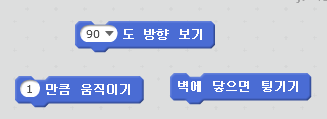
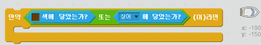

--- challenge ---

## 도전과제: 더 많은 장애물!

게임에 장애물을 더 추가할 수 있을까요? 여기에 몇 가지 아이디어가 있습니다 :

--- task ---

녹색 슬라임을 배경에 추가하고 보트가 슬라임에 닿으면 느려지도록 게임을 변화시킬 수 있습니다.

--- hints --- --- hint --- `기다리기` 블록을 사용해봅시다:  --- /hint --- --- /hints ---

--- /task ---

--- task ---

통나무나 상어처럼 움직이는 장애물도 추가할 수 있어요!

--- hints --- --- hint --- 이 블록들은 새로운 장애물이 움직이는 데 도와줄 겁니다 :

새로운 장애물이 갈색이 아니면, 배의 코드에 다음을 추가해야 합니다:

 --- /hint --- --- /hints ---

--- /task ---

--- /challenge ---