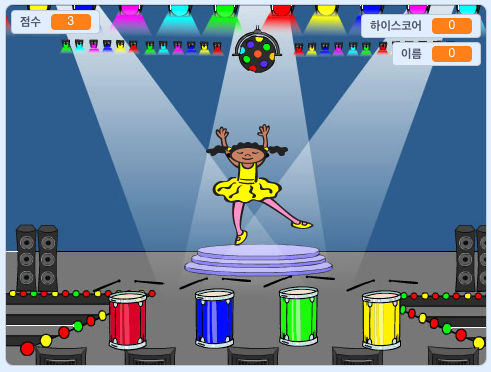

## 다음은?

축하합니다! 프로젝트가 완성되었습니다! 조금 더 어려운 것에 도전하고 싶나요?

[메모리](https://projects.raspberrypi.org/en/projects/memory?utm_source=pathway&utm_medium=whatnext&utm_campaign=projects) 프로젝트를 시도해 보세요.

\--- no-print \--- 녹색 깃발을 클릭하여 시작하세요. 발레리나의 드레스에 나타나는 색깔의 순서를 보고, 함께 연주되는 드럼 소리를 들어보세요. 그런 다음 발레리나의 드레스 색깔 순서대로 반복해 보세요. 순서가 틀리면 게임이 끝납니다!

  <iframe allowtransparency="true" width="485" height="402" src="//scratch.mit.edu/projects/embed/284452634/?autostart=false" frameborder="0" allowfullscreen scrolling="no" mark="crwd-mark"></iframe> 

\--- /no-print \---

\--- print-only \---  \--- /print-only \---