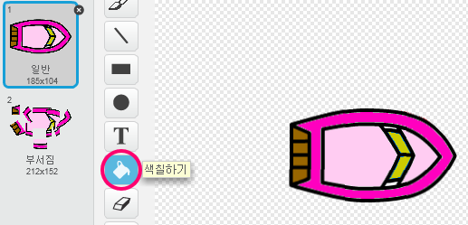
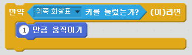

\--- challenge \---

## 도전과제: 더 많은 보트들!

게임을 두명의 플레이어의 경주로 바꿀 수 있나요? 두번째 플레이어는 배를 앞으로 움직이기 위해 위쪽 화살표, 옆으로 돌리기 위해 왼쪽 화살표와 오른쪽 화살표를 사용할 것입니다.

\--- hints \--- \--- hint \--- 배를 복사하고 배2 의 색을 변경하세요.

 \--- /hint \--- \--- hint \--- 이 코드를 바꿔서 두 배가 서로 다른 위치에서 시작하도록 만들어 보세요.

 \--- /hint \--- \--- hint \--- 배2에서 마우스를 사용해 움직이는 코드를 지우고 화살표를 사용해 배2를 움직일 수 있도록 코드를 바꿔보세요. \--- /hint \--- \--- hint \--- 배2를 앞으로 움직이는데 필요한 코드입니다.

 \--- /hint \--- \--- hint \--- 왼쪽 화살표와 오른쪽 화살표를 눌러서 배를 *회전*시킬 수 있도록 하는 코드도 필요합니다. \--- /hint \--- \--- /hints \---

\--- /challenge \---