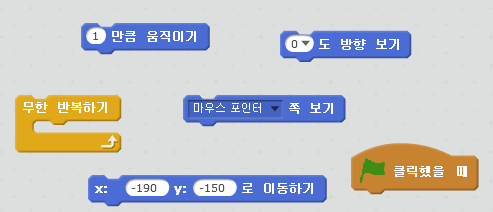
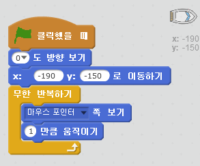
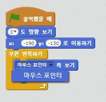
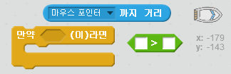

## 배 조종하기

--- task ---

마우스로 배를 조종하려고 합니다. 배가 왼쪽 아래 모퉁이에서 위를 향하여 출발하며 마우스 포인터를 따라가도록 코드를 추가합니다. 계획된대로 실행하는지 확인하기 위해 **작성한 코드를 테스트**하세요.

--- hints --- --- hint --- `녹색 깃발이 클릭되면`, 배가 `시작 지점에 놓이도록` 하고 `방향을 위로 향하게` 합니다. 다음으로 `마우스 포인터를 가리키도록` 하며 `1만큼 움직이게` 합니다. 이 작업이 `무한히 반복`돼야 합니다.

--- /hint --- --- hint --- 필요한 코드 블럭은 다음과 같습니다.  --- /hint --- --- hint --- 코드는 이런 형태로 만들어져야 합니다.  --- /hint --- --- /hints ---

--- /task ---

--- task ---

녹색 깃발을 클릭하고 마우스를 움직여 배를 테스트하세요. 배가 마우스 쪽으로 이동하나요?

--- collapse ---
---
title: 만약 문제가 생겼다면...
image: images/image.png
---
**참고:** 현재 스크래치에 버그가 있어, 배가 마우스 포인터 방향으로 움직이지 않을 수 있습니다. 만일 버그가 발생한다면, `[쪽 보기]` 블록의 화살표를 클릭하여 `마우스 포인터`를 다시 선택합니다.

 --- /collapse ---

--- /task ---

--- task ---

배가 마우스 포인터에 도착하면 어떻게 되나요? 시도해 보세요.

--- /task ---

--- task ---

이를 방지하려면, 배가 마우스로부터 5 픽셀보다 멀어졌을 경우에만 움직이도록 `만약` 블록을 추가해야 합니다.

--- hints --- --- hint --- 배는 오로지 마우스 포인터를 향해서 움직여야 하고 `만일` 배에서 `마우스 포인터까지의 거리`가 `5 픽셀보다 크면` 움직여야 합니다. --- /hint --- --- hint --- 필요한 코드 블록은 다음과 같습니다:  --- /hint --- --- hint --- 작성해야 하는 코드의 형태입니다:  --- /hint --- --- /hints ---

--- /task ---

--- task ---

문제가 해결되었는지 확인하기 위해 배를 다시 테스트 해보세요.

--- /task ---