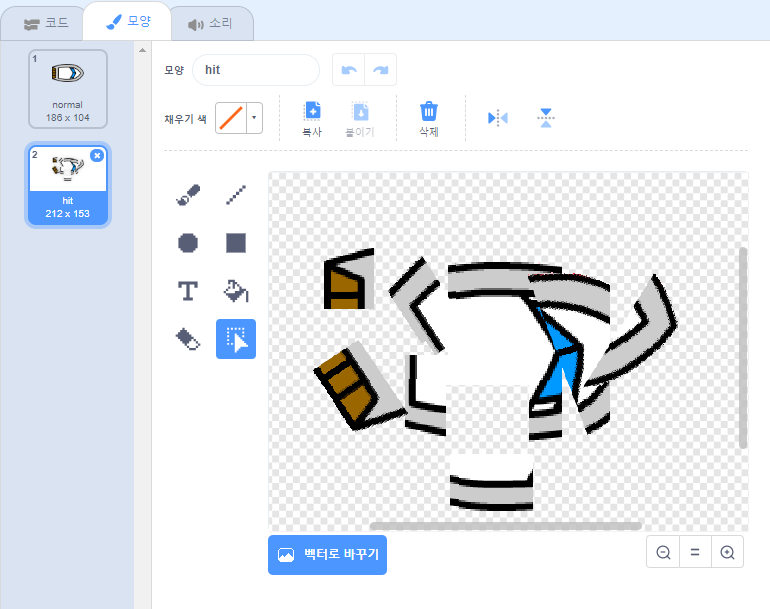

## 충돌처리!

현재 보트 스프라이트는 나무 장벽을 통과 할 수 있습니다. 이제 그 문제를 해결할 것입니다.

\--- task \---

배에는 두 가지 모양이 필요한데, 하나는 정상적일 때, 그리고 하나는 배가 부서졌을 때의 모양입니다. 현재 배의 모양을 복사하고, 하나는 '정상' 다른 하나는 '충돌' 이라는 이름을 짓습니다.

\--- /task \---

\--- task \---

'hit' 코스튬을 클릭하고 ** 선택을 사용하십시오. ** 이 도구는 침몰 한 것처럼 보이게하기 위해 배가 이동하고 회전시킵니다.



\--- /task \---

\--- task \---

갈색 나무 장벽에 배가 닿았을 때 배가 부서지도록 코드를 추가합니다.

\--- hints \--- \--- hint \---

You need to add code blocks inside your `forever`{:class="block3control"} loop so that your code keeps checking if the boat sprite has crashed, and if it has crashed, the code needs to reset the boat sprite's position.

`if`{:class="block3control"} the boat is `touching`{:class="block3sensing"} the brown colour of the wood, you need to `switch to the hit costume`{:class="block3looks"}, `say Noooo! for 2 seconds`{:class="block3looks"}, and then `switch back to the normal costume`{:class="block3looks"}. Finally, you'll need to `point up`{:class="block3motion"} and `go to the start position`{:class="block3motion"}.

\--- /hint \--- \--- hint \---

Here are the code blocks you need:


```blocks3
만약 <touching color [ ] ?> 이라면
끝

x: (-190) y: (-150) 으로 이동

모양을 (hit v) 으로 바꾸기

(0) 도 방향 보기 

모양을 (normal v) 로 바꾸기

[Noooooo!] 를 (2) 초 동안 말하기
```

\--- /hint \--- \--- hint \---

Here's what your code should look like:


```blocks3
녹색 깃발을 클릭했을 때
(0) 도 방향 보기
x: (-190) y: (-150) 으로 이동하기
무한 반복하기
만약 < ((마우스 포인터 v) 까지의 거리) > [5] > 라면
(마우스 포인터 v) 쪽 보기
(1) 만큼 움직이기
끝
만약 <touching color [#663b00] ?> 이라면
모양을 (hit v) 로 바꾸기
[Noooooo!] 를 (2) 초 동안 말하기
모양을 (normal v)로 바꾸기
(0) 도 방향 보기
x: (-190) y: (-150) 으로 이동하기
끝
```

\--- /hint \--- \--- /hints \---

\--- /task \---

\--- task \---

You should also add code to make sure that your boat sprite always starts out looking 'normal'.

Test your code again. If you try to sail the boat through a wooden barrier now, the boat should crash and then move back to its starting position.


\--- /task \---