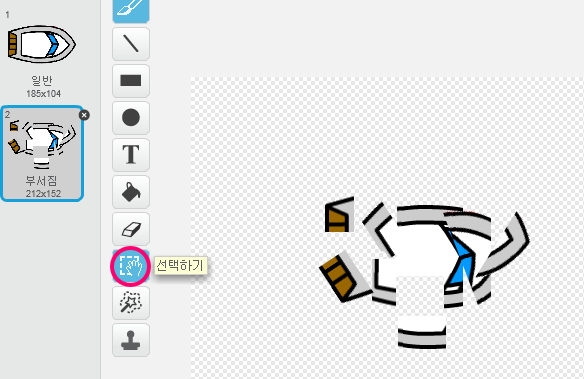
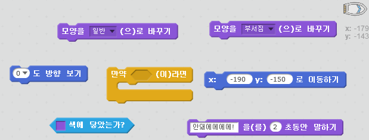
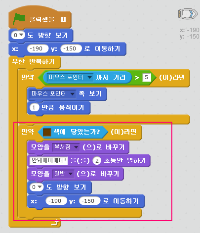
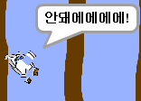

## 충돌!

지금은 배가 나무 장벽을 통과하여 움직일 수 있습니다. 이 부분을 고쳐봅시다.

\--- task \---

배에 두 가지 모양이 필요합니다. 하나는 정상적일 때, 그리고 하나는 배가 부서졌을 때의 모양입니다. 현재 배의 모양을 복사하고, 하나는 '일반' 다른 하나는 '부서짐' 이라는 이름을 짓습니다.

\--- /task \---

\--- task \---

'부서짐' 모양을 클릭하고 선택하기 도구를 이용해 배의 부분들을 잡아 부서진 것처럼 보이도록 여기저기 이동시켜 회전합니다.

\--- /task \---

\--- task \---

이제 모든 갈색 나무 조각에 배가 닿았을 때 부딪히고 배가 부서지도록 코드를 추가합니다.

\--- hints \--- \--- hint \--- 배가 충돌했는지 계속 확인할 수 있도록 `무한 반복하기` 반복문을 추가합니다. `만약` 배가 나무의 갈색 부분에 `닿았다면`, `모양을 '부서짐'으로 바꾸도록` 하고, `'안돼에에에에!!'라고 2초 동안 말하도록` 하며, `다시 '일반'모양으로 돌아오도록` 수정합니다. 마지막으로, `위쪽 방향을 보도록` 설정하고 `처음 위치로 움직이게` 해야 합니다. \--- /hint \--- \--- hint \--- 필요한 코드 블럭은 다음과 같습니다:  \--- /hint \--- \--- hint \--- 작성해야 하는 코드의 형태입니다:  \--- /hint \--- \--- /hints \---

\--- /task \---

\--- task \---

배가 항상 '일반'모양으로 시작하는지 확인해야 합니다.

이제 나무로 된 장벽을 통과해 움직이려고 하면, 배가 부서지고 처음 위치로 돌아가는 것을 볼 수 있습니다.

\--- /task \---