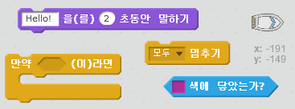
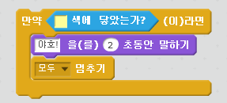

## Challenge: 승리!

플레이어가 무인도에 도착했을 때 승리하도록 다른 `만약` 블록을 추가할 수 있나요?

배가 노란색 무인도에 닿으면 '야호!' 라고 말하고 게임이 멈춰야 합니다.

\--- hints \--- \--- hint \--- 플레이어가 이겼는지 계속 확인하도록 `무한 반복하기` 반복문을 코드에 추가합니다. `만약` 배가 보물섬의 `색깔에 닿았`다면, `'야호!' 하고 2초동안 말하고`나서, 게임을 끝내기 위해 `모두 멈추기` 블록를 실행합니다. \--- /hint \--- \--- hint \--- 필요한 코드 블럭은 다음과 같습니다:  \--- /hint \--- \--- hint \--- 작성해야 하는 코드의 형태입니다: 

새로운 코드는 `무한 반복하기` 반복문 안에 있어야 한다는 점을 잊지 마세요.