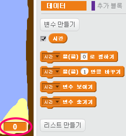
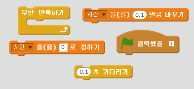
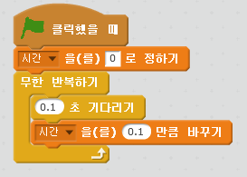
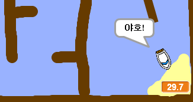

## 시간 제한

게임에 타이머를 추가하여, 플레이어가 가능한 빨리 무인도에 도착하게 합시다.

\--- task \---

새 변수 `시간`을 만들어 무대에 추가합니다. 새 변수가 어떻게 보일지를 변경할 수 있습니다.

[[[generic-scratch-add-variable]]]

\--- /task \---

\--- task \---

이제 배가 무인도에 도착할 때까지 타이머가 시간을 잴 수 있도록 무대에 코드를 추가하세요.

\--- hints \--- \--- hint \--- 무대에서, `깃발을 클릭하면`, `시간을 0으로 설정`합니다. `무한 반복하기` 블록 안에서 `0.1초 기다리기` 후에 `시간을 0.1만큼 바꾸기`합니다. \--- /hint \--- \--- hint \--- 필요한 코드 블럭은 다음과 같습니다: \--- /hint \--- \--- hint \--- 작성해야 하는 코드의 형태입니다:  \--- /hint \--- \--- /hints \---

\--- /task \---

\--- task \---

바로 이거에요! 게임을 테스트하여 배가 얼마나 빠르게 무인도에 도달할 수 있는지 확인해 보세요!

\--- /task \---