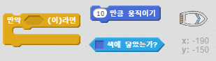
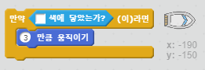
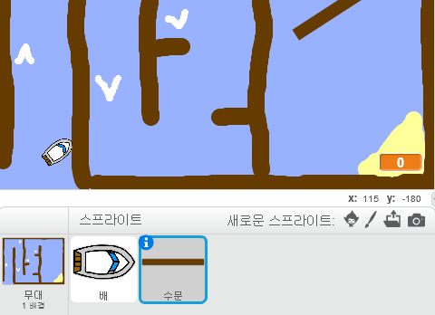
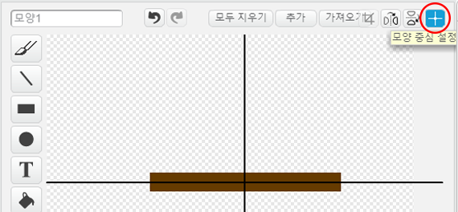
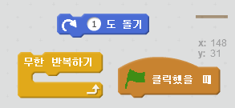
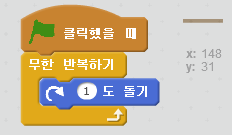
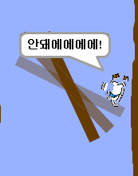

## 장애물과 부스터

지금 이 게임은 *지나치게* 매우 쉽습니다. - 더 재미있는 것들을 추가해봅시다.

--- task ---

먼저 배의 속도를 올리기 위해 '부스트'를 추가합시다. 무대 배경을 수정하고 하얀색 부스터 화살표를 추가하세요.

--- /task ---

--- task ---

이제 배가 하얀색 부스터에 닿으면 3만큼 더 이동하도록 배의 무한 반복하기 루프 안에 코드를 추가합니다.

--- hints --- --- hint --- `만약`, 배가 `하얀색 부스터에 닿으면` 배는 추가로 `3만큼 움직이기` 를 수행해야 합니다.  
--- /hint --- --- hint --- 필요한 코드 블럭은 다음과 같습니다:  --- /hint --- --- hint --- 작성해야 하는 코드의 형태입니다:  --- /hint --- --- /hints ---

--- /task ---

--- task ---

배가 피해야 하는 회전문을 추가할 수도 있습니다. 다음과 같이 보이는 '수문' 이라는 새 스프라이트를 추가하세요.:

수문의 색이 나무 장애물과 같은 색인지 확인하세요.

--- /task ---

--- task ---

수문 스프라이트의 중심을 설정합니다.

--- /task ---

--- task ---

수문이 천천히 돌기를 무한히 반복하도록 코드를 추가하세요.

--- hints --- --- hint --- 수문 스프라이트에 `1도씩 회전` `무한 반복하기` 코드를 추가합니다. --- /hint --- --- hint --- 필요한 코드 블럭은 다음과 같습니다:  --- /hint --- --- hint --- 작성해야 하는 코드의 형태입니다:  --- /hint --- --- /hints ---

--- /task ---

--- task ---

게임을 테스트 해 보세요. 이제 피해가야 할 회전문이 게임에 생겨야 합니다.

--- /task ---