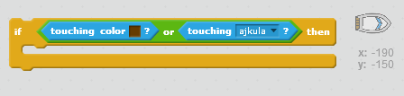

\--- challenge \---

## Izazov: više prepreka!

Da li možeš da dodaš još prepreka u svoju igru? Evo nekoliko ideja:

\--- task \---

Na pozadinu možeš da dodaš zelene alge i da napraviš izmjene u igri tako da alge usporavaju brod kada ih dodirne.

\--- hints \--- \--- hint \--- Možeš da koristiš blok `wait` (čekaj) da to napraviš:  \--- /hint \--- \--- /hints \---

\--- /task \---

\--- task \---

Možeš da dodaš objekat koji se kreće, kao što je balvan ili ajkula!

\--- hints \--- \--- hint \--- Ovi blokovi mogu ti pomoći da napraviš da se tvoj novi objekat kreće:

Ako tvoj novi objekat nije smeđe boje, kôdu za brod treba da dodaš sljedeće:

 \--- /hint \--- \--- /hints \---

\--- /task \---

\--- /challenge \---