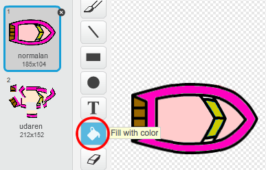

\--- challenge \---

## Izazov: više brodova!

Možeš li da pretvoriš svoju igru u trku između 2 igrača? Drugi igrač treba da upravlja brodom tako što će koristiti taster sa strelicom nagore za kretanje naprijed, a tastere sa strelicama ulijevo i udesno za skretanje.

\--- hints \--- \--- hint \--- Napravi kopiju broda i promijeni boju broda2.

 Napravi da brodovi kreću sa različitih pozicija tako što ćeš izmijeniti sljedeći kôd:

 \--- /hint \--- \--- hint \--- Izbriši kôd broda2 koji koristi miša i zamijeni ga kôdom za upravljanje brodom2 koristeći tastere sa strelicama. \--- /hint \--- \--- hint \--- Ovo je kôd koji će ti biti potreban da se brod2 kreće naprijed:

 \--- /hint \--- \--- hint \--- Takođe će ti biti potreban kôd da brod *skreće* (turn) kada se pritisnu tasteri sa strelicama ulijevo i udesno. \--- /hint \--- \--- /hints \---

\--- /challenge \---