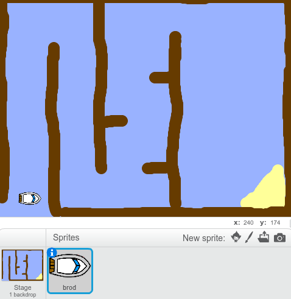

## Početni koraci

--- task ---

Otvori početni projekat.

--- collapse ---
---
title: Koristim Scratch online
image: images/image.png
---

Otvori početni Scratch projekat 'Boat Race' na [jumpto.cc/boat-go](https://scratch.mit.edu/projects/239834816/#editor){:target="_blank"}. --- /collapse ---

--- collapse ---
---
title: Koristim Scratch offline
image: images/image.png
---
Preuzmi početni Scratch projekat 'Boat Race' sa [jumpto.cc/boat-get](http:jumpto.cc/boat-get-me-ME)(https://github.com/raspberrypilearning/boat-race/raw/master/me-ME/resources/BoatRaceResources.sb2) i otvori ga koristeći offline editor. --- /collapse ---

--- /task ---

--- task ---

Projekat sadrži lik broda i pozadinu sa:

- Drvima koja tvoj brod treba da izbjegne
- Pustim ostrvom do kojeg tvoj brod treba da stigne
    
    

--- /task ---