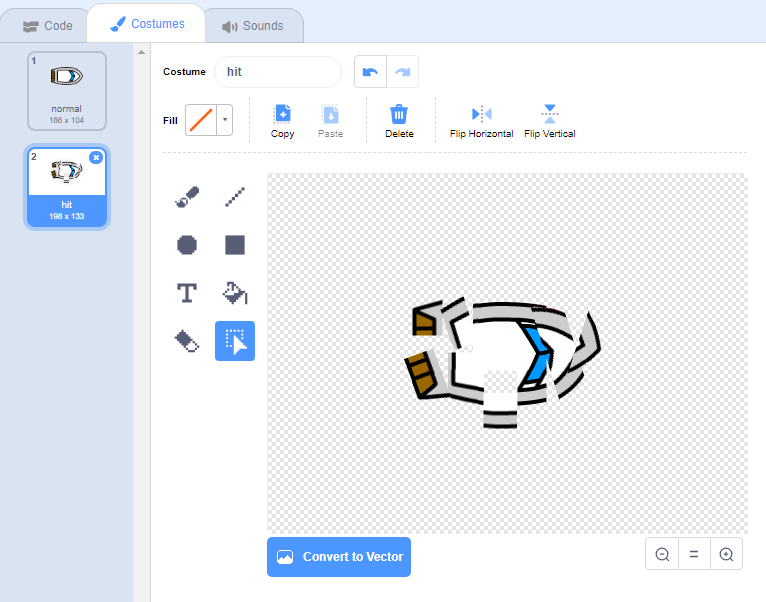
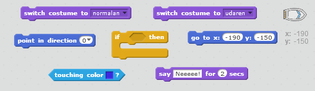
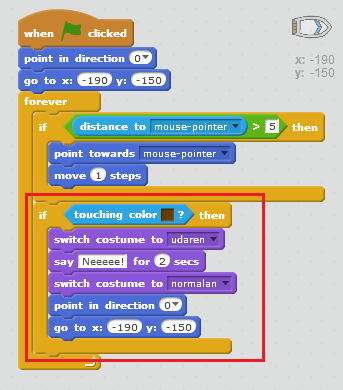
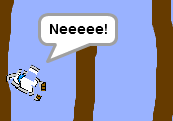

## Sudaranje!

Trenutno, tvoj brod može da plovi kroz drvene prepreke! Hajde da to popravimo.

\--- task \---

Biće ti potrebna dva kostima za brod, jedan normalan i jedan kada se brod sudari. Umnoži (duplicate) kostim broda i jednom kostimu daj naziv 'normalan', a drugom 'udaren'.

\--- /task \---

\--- task \---

Klikni na kostim 'udaren' i odaberi alat 'Select' (Označi). Sada možeš da uhvatiš komadiće broda, da ih premještaš i rotiraš tako da brod izgleda kao da se sudario.

\--- /task \---

\--- task \---

Sada dodaj kôd svom brodu tako da se sudari i razbije kada dodirne bilo koji komad drveta smeđe boje.

\--- hints \--- \--- hint \--- Kôd treba da dodaš unutar petlje `forever` (ponavljaj) tako da kôd stalno provjerava da li se brod sudario. `Ako` (if) brod `dodiruje` (touching) smeđu boju drveta, treba da `promijeni kostim u udaren` (switch costume to), `govori Neeee! 2 sekunde`, a zatim `promijeni kostim u normalan` (switch costume to). Na kraju, treba da ` se okrene prema gore` (point up) i da `ode na početnu poziciju` (go to the start position). \--- /hint \--- \--- hint \--- Ovdje su blokovi kôda koji će ti biti potrebni:  \--- /hint \--- \--- hint \--- Ovako bi trebalo da izgleda tvoj kôd:  \--- /hint \--- \--- /hints \---

\--- /task \---

\--- task \---

Takođe, treba da vodiš računa da tvoj brod uvijek na početku ima 'normalan' izgled.

Ako sada pokušaš da ploviš kroz drvenu prepreku, trebalo bi da vidiš kako se tvoj brod sudara i vraća na početnu poziciju.

\--- /task \---