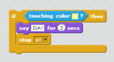

## Izazov: pobjeda!

Da li možeš da dodaš još jednu naredbu `if` (ako) u kôd svog broda, tako da igrač pobijedi kada stigne do pustog ostrva?

Kada brod stigne do žutog pustog ostrva, igra treba da kaže 'DA!' i da se se završi.

--- hints --- --- hint --- Treba da dodaš kôd unutar petlje `forever` (ponavljaj) tako da tvoj kôd stalno provjerava da li je igrač pobijedio. `Ako` (if) brod `dodiruje` (touching) boju ostrva sa blagom, treba da `govori 'DA!' 2 sekunde`, a zatim treba da `zaustaviš sve` (stop all) kako bi se igra završila. --- /hint ------ hint --- Ovdje su blokovi kôda koji će ti biti potrebni:  --- /hint --- --- hint --- Ovako bi trebalo da izgleda tvoj kôd:--- /hint --- --- /hints: 

Ne zaboravi da novi kôd treba da bude unutar petlje `forever` (ponavljaj). --- /hint --- --- /hints ---