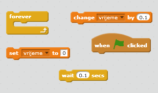
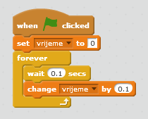
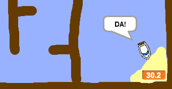

## Mjerenje vremena

Dodajmo u tvoju igru brojač vremena, tako da igrač treba da stigne do pustog ostrva što je brže moguće.

--- task ---

Dodaj na svoju pozornicu novu promjenljivu (variable) pod nazivom `vrijeme`. Možeš i da promijeniš prikaz svoje nove promjenljive.

[[[generic-scratch-add-variable]]]

--- /task ---

--- task ---

Sada dodaj kôd Pozornici (Stage) tako da brojač vremena odbrojava sve dok brod ne stigne do pustog ostrva.

--- hints --- --- hint --- Na Pozornici, `kada je kliknuto na zelenu zastavicu` (when the green flag is clicked), `postavi vrijeme na 0` (set vrijeme to 0). Unutar bloka `ponavljaj` (forever), prvo `čekaj 0.1 sekundu` (wait 0.1 secs), a zatim `promijeni vrijeme za 0.1` (change vrijeme by 0.1). --- /hint --- --- hint --- Ovdje su blokovi kôda koji će ti biti potrebni:  --- /hint --- --- hint --- Ovako bi trebalo da izgleda tvoj kôd:  --- /hint --- --- /hints ---

--- /task ---

--- task ---

I to je sve! Isprobaj svoju igru i provjeri koliko brzo možeš da stigneš do pustog ostrva!

--- /task ---