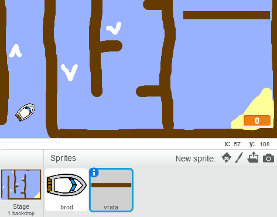
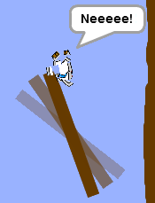

## Prepreke i prednosti

Trenutno je ova igra *previše* laka - dodajmo ponešto da bismo je napravili zanimljivijom.

--- task ---

Hajde prvo da u tvoju igru dodamo 'pojačanje' koje će ubrzati brod. Izmijeni pozadinu pozornice (stage backdrop) tako što ćeš na nju dodati nekoliko bijelih strelica za ubrzanje broda.

--- /task ---

--- task ---

Sada dodaj kôd u petlju forever (ponavljaj) svog broda tako da se brod pomjeri još tri dodatna koraka kada dodirne bijelu strelicu.

--- hints --- --- hint --- `Ako` (if) tvoj brod `dodiruje bijelu strelicu` (touching a white booster) treba da `ide 3 dodatna koraka` (move 3 extra steps).  
--- /hint --- --- hint --- Ovdje su blokovi kôda koji će ti biti potrebni:  --- /hint --- --- hint --- Ovako bi trebalo da izgleda tvoj kôd:  --- /hint --- --- /hints ---

--- /task ---

--- task ---

Možeš da dodaš i vrata koja se okreću i koja tvoj brod treba da izbjegne. Dodaj novi lik 'vrata' koji izgleda ovako:

Postaraj se da boja vrata i drvenih prepreka bude ista.

--- /task ---

--- task ---

Postavi centar (set the center) lika vrata.

--- /task ---

--- task ---

Svojim vratima dodaj kôd da se neprestano polako okreću.

--- hints --- --- hint --- Dodaj kôd liku vrata tako da se `neprestano` (forever) `okreće za 1 stepen` (turn 1 degree). --- /hint --- --- hint --- Ovdje su blokovi kôda koji će ti biti potrebni:  --- /hint --- --- hint --- Ovako bi trebalo da izgleda tvoj kôd:  --- /hint --- --- /hints ---

--- /task ---

--- task ---

Isprobaj svoju igru. Sada bi trebalo da imaš vrata koja se okreću i koja moraš da izbjegneš.

--- /task ---