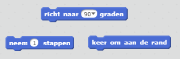

\--- challenge \---

## Challenge: meer hindernissen!

Kun je meer hindernissen toevoegen aan je spel? Hier zijn enkele ideeën:

\--- task \---

Je kunt groen slijm aan je achtergrond toevoegen en wijzigingen aanbrengen in het spel, zodat het slijm de boot vertraagt ​​wanneer de speler ze aanraakt.

\--- hints \--- \--- hint \--- Je kunt dit doen door een `wacht` blok toe te voegen:  \--- /hint \--- \--- /hints \---

\--- /task \---

\--- task \---

Je zou een bewegend voorwerp zoals een blok hout of een haai kunnen toevoegen!

\--- hints \--- \--- hint \--- Deze blokken kunnen je helpen bij het verplaatsen van je nieuwe object:

Als je nieuw object niet bruin is, moet je het toevoegen aan je bootcode:

 \--- /hint \--- \--- /hints \---

\--- /task \---

\--- /challenge \---