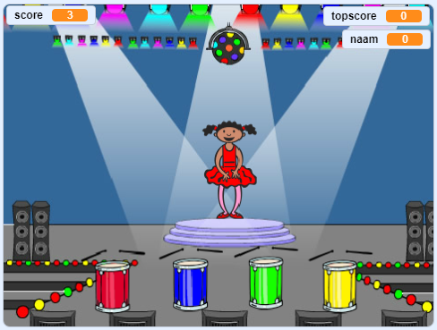

## Wat kun je verder nog doen?

Gefeliciteerd met het voltooien van het project 'Bootrace'! Wil je iets uitdagenders proberen?

Je zou het [Geheugenspel](https://projects.raspberrypi.org/en/projects/memory?utm_source=pathway&utm_medium=whatnext&utm_campaign=projects) project kunnen uitproberen.

\--- no-print \--- Klik op de groene vlag om te starten. Kijk naar de reeks kleuren van de jurk van de danseres en luister naar de bijbehorende slagen op de trommels, en herhaal ze daarna. Als je de verkeerde volgorde van de kleuren kiest, is het spel voorbij!

  <iframe allowtransparency="true" width="485" height="402" src="//scratch.mit.edu/projects/embed/284452634/?autostart=false" frameborder="0" allowfullscreen scrolling="no" mark="crwd-mark"></iframe> 

\--- /no-print \---

\--- print-only \---  \--- /print-only \---