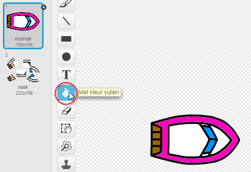
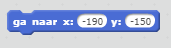
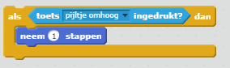

--- challenge ---

## Uitdaging: meer boten!

Kun jij jouw spel veranderen in een race tussen 2 spelers? De tweede speler moet zijn boot besturen met de pijl omhoog om vooruit te gaan en de pijltoetsen links en rechts om te draaien.

--- hints --- --- hint --- Kopieer de boot en verander de kleur van boot2.

 --- / hint --- --- hint --- Laat de twee boten op verschillende plaatsen starten door deze code te wijzigen:

 --- / hint --- --- hint --- Verwijder de code van boot2 welke de muis gebruikt en vervang deze door code om boot2 te besturen met behulp van de pijltjestoetsen. --- / hint --- --- hint --- Dit is de code die je nodig hebt om boot2 naar voren te verplaatsen:

 --- / hint --- --- hint --- Je hebt ook code nodig om de boot *te draaien* wanneer de linker- of rechter pijltoets wordt ingedrukt. --- / hint --- --- / hints ---

--- /challenge ---