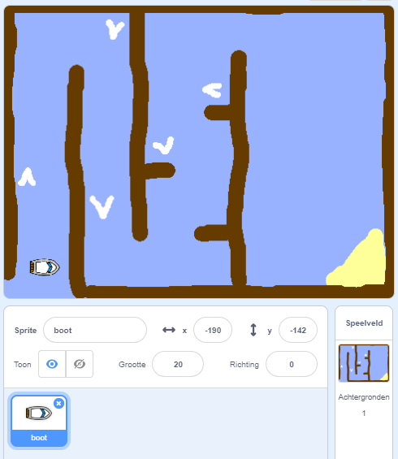

## Aan de slag

\--- task \--- Open het startersproject.

**Online:** open het online startersproject op [ rpf.io/boat-race-starter-on](http://rpf.io/boat-race-starter-on){:target="_ blank"}, en klik op **Remix**.

**Offline** download het startersproject [rpf.io/p/en/boat-race-get](http://rpf.io/p/en/boat-race-get){:target="_ blank"} en open het vervolgens met behulp van de offline editor.

Als je de Scratch offline editor wilt downloaden en installeren, dan kan je die vinden op [rpf.io/scratchoff](http://rpf.io/scratchoff). \--- /task \---

\--- task \----

Het project omvat een boot-sprite en een racecircuit-achtergrond met:

- Hout dat de boot-sprite moet vermijden
- Een onbewoond eiland waar je boot naartoe moet
    
    

\--- /task \---