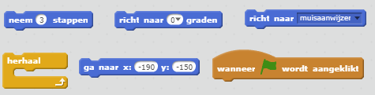
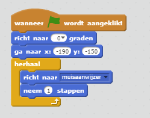
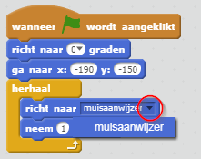
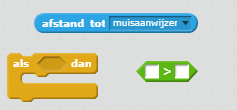
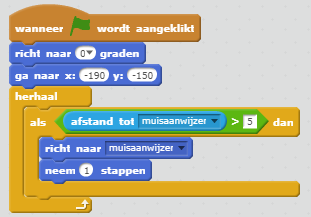

## De boot besturen

\--- task \---

Je gaat de boot met je muis besturen. Voeg code toe zodat je boot in de linkerbenedenhoek begint, zorg ervoor dat je boot naar omhoog wijst en vervolgens de muisaanwijzer volgt. ** Test je code ** om te kijken of de boot doet, wat het zou moeten doen.

\--- hints \--- \--- hint \--- Nadat op de groene vlag ` is geklikt `, moet je de boot ` naar de startpositie laten gaan ` en ` omhoog wijzen `. Vervolgens moet de boot ` naar de muisaanwijzer richten ` en ` 1 stap verplaatsen `. Dit zal je steeds moeten ` herhalen `.

\--- /hint \--- \--- hint \--- Dit zij de code blokken die je nodig hebt:  \--- /hint \--- \--- hint \--- Zo zou je code er moeten uitzien:  \--- /hint \--- \--- /hints \---

\--- /task \---

\--- task \---

Test je boot door op de vlag te klikken en de muis te bewegen. Vaart de boot richting de muisaanwijzer?

## \--- collapse \---

title: Als je problemen hebt ...

## image: images/image.png

** Opmerking: ** Er zit momenteel een fout in Scratch, wat betekent dat je boot mogelijk niet in de richting van de muisaanwijzer beweegt. Als dit gebeurt, klik je op het pijltje naast richt naar ` muisaanwijzer ` en selecteer muisaanwijzer ` opnieuw `.

 \--- /collapse \---

\--- /task \---

\--- task \---

Wat gebeurt er als de boot de muisaanwijzer bereikt? Probeer het eens.

\--- /task \---

\--- task \---

Als je wilt voorkomen dat dit gebeurt, moet je een ` als dan ` blok aan je code toevoegen, zodat de boot alleen beweegt als deze zich op meer dan 5 pixels van de muisaanwijzer bevindt.

\--- hints \--- \--- hint \--- De boot mag alleen naar de muisaanwijzer wijzen en bewegen `als>` de `afstand tot muisaanwijzer` `groter is dan 5 pixels`. \--- /hint \--- \--- hint \--- Dit zij de code blokken die je nodig hebt:  \--- /hint \--- \--- hint \--- Zo zou je code er moeten uitzien:  \--- /hint \--- \--- /hints \---

\--- /task \---

\--- task \---

Test je boot opnieuw om te controleren of het probleem is opgelost.

\--- /task \---