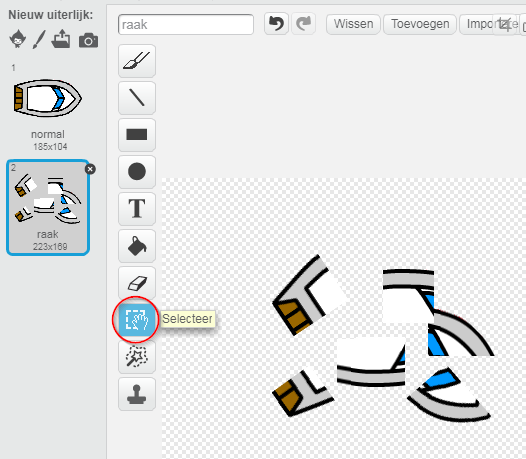
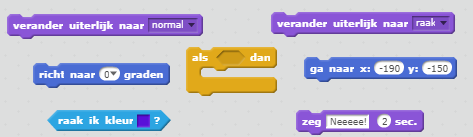
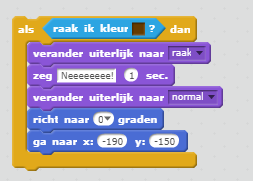
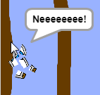

## Botsen

Op dit moment kan je boot door de houten hindernis varen! Laten we dat oplossen.

--- task ---

Je hebt twee uiterlijken voor je boot nodig, een normaal uiterlijk en een voor wanneer de boot crasht. Maak een kopie van het huidige uiterlijk en noem één uiterlijk 'normaal' en de andere 'raak'.

--- /task ---

--- task ---

Klik op je 'raak'-uiterlijk en kies het gereedschap Selecteer om stukjes van de boot te pakken, te verplaatsen en rond te draaien om het eruit te laten zien alsof het gecrasht is.

--- /task ---

--- task ---

Voeg nu code aan je boot toe zodat deze crasht en breekt als deze de bruine houten hindernis raakt.

--- hints --- --- hint --- Je moet code toevoegen in je `herhaal` lus zodat je code blijft controleren of de boot is gecrasht. `Als` de boot de kleur `bruin` raakt moet `de boot veranderen naar het uiterlijk raak` en `zeg Neeee! gedurende 2 seconden` en vervolgens `terugschakelen naar het normale uiterlijk`. Ten slotte moet de boot `omhoog wijzen` en `naar de startpositie gaan`. --- /hint --- --- hint --- Dit zij de code blokken die je nodig hebt:  --- /hint --- --- hint --- Zo zou je code er moeten uitzien:  --- /hint --- --- /hints ---

--- /task ---

--- task ---

Je moet er ook voor zorgen dat je boot er altijd 'normaal' uitziet.

Als je nu probeert door een houten hindernis te varen, zul je zien dat je boot crasht en teruggaat naar het begin.

--- /task ---
