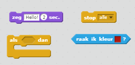
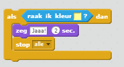

## Uitdaging: winnen!

Kun je nog een `als` code toevoegen aan je boot, zodat de speler wint wanneer hij/zij het onbewoonde eiland bereikt?

Wanneer de boot het gele onbewoonde eiland bereikt, moet het spel 'JA' zeggen! en dan zou het spel moeten stoppen.

--- hints --- --- hint --- Je moet code in je `herhaal` lus toevoegen zodat je code blijft controleren of de boot is gecrasht. `Als` de boot `de kleur van het schateiland raakt`, moet de boot `'JA!' zeggen gedurende 2 seconden` en dan `stop alle` om het spel te beëindigen. --- /hint --- --- hint --- Dit zij de code blokken die je nodig hebt:  --- /hint --- --- hint --- Zo zou je code er moeten uitzien: 

Vergeet niet dat de nieuwe code in je `herhaal` lus moet staan. --- /hint --- --- /hints ---
