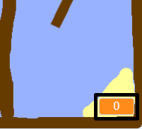

## Een meting toevoegen

Laten we een timer aan je spel toevoegen, zodat de speler zo snel mogelijk naar het onbewoonde eiland moet.

--- task ---

Maak een nieuwe variabele met de naam `tijd`{:class="block3variables"} aan.



[[[generic-scratch3-add-variable]]]

Je timer kan op verschillende manieren worden weergegeven.

--- /task ---

--- task ---

Voeg nu code toe, zodat de tijd oploopt tot de boot het onbewoonde eiland bereikt.

--- hints ---
 --- hint --- In het speelveld, `wanneer op de groene vlag wordt geklikt`{:class="block3variables"} `zet de tijd op 0`{:class="block3variables"}. In je `herhaal`{:class="block3control"} lus moet je eerst `wacht 0,1 sec.`{:class="block3control"} en daarna `verander tijd met 0.1`{:class="block3variables"} uitvoeren.
--- /hint ---
 --- hint --- Dit zijn de codeblokken die je nodig hebt: 

```blocks3
change [tijd v] by (0.1)

when flag clicked

forever
end

wait (0.1) seconds

set [tijd v] to [0]
```

--- /hint --- --- hint --- Zo zou je code er uit moeten zien: 

```blocks3
when flag clicked
set [tijd v] to [0]
forever
wait (0.1) seconds
change [tijd v] by (0.1)
end
```

--- /hint ------ /hints ---

--- /task ---

--- task ---

Test je spel en kijk hoe snel je de boot naar het eiland kunt krijgen!


--- /task ---