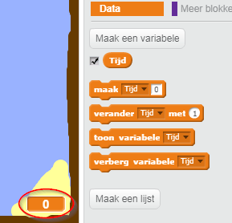
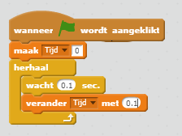

## Tijd bijhouden

Laten we een klok aan je spel toevoegen, zodat de speler zo snel mogelijk naar het onbewoonde eiland moet.

\--- task \---

Maak een nieuwe variabele (Data) met de naam ` tijd `. Je kunt ook de weergave van je nieuwe variabele wijzigen.

[[[generic-scratch-add-variable]]]

\--- /task \---

\--- task \---

Voeg nu code toe, zodat de tijd oploopt tot de boot het onbewoonde eiland bereikt.

\--- hints \--- \--- hint \--- `Zet de de tijd op 0 ` ` wanneer op de groene vlag wordt geklikt `. In je ` herhaal ` blok, moet je eerst ` wacht 0,1 sec ` toe voegen en ` verander dan de variabele tijd met 0.1 `. \--- /hint \--- \--- hint \--- Dit zij de code blokken die je nodig hebt:  \--- /hint \--- \--- hint \--- Zo zou je code er moeten uitzien:  \--- /hint \--- \--- /hints \---

\--- /task \---

\--- task \---

Dat is alles! Test je spel en kijk hoe snel je het onbewoonde eiland kunt bereiken!

\--- /task \---