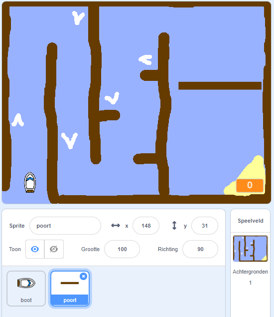
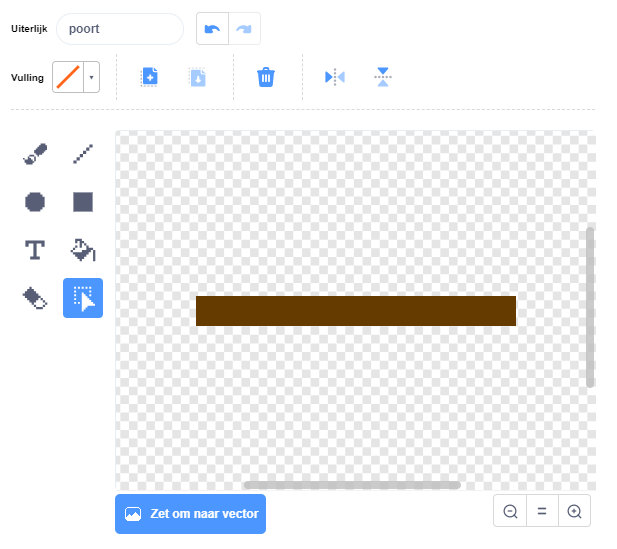
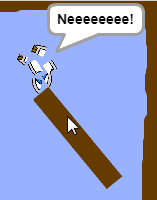

## Obstakels en versnellers

Op dit moment is dit spel **veel** te gemakkelijk - laten we dingen toevoegen om het interessanter te maken.

Eerst voeg je een aantal versterkers toe om de boot te versnellen.

--- task ---

Bewerk je achtergrond door enkele witte versterkerpijlen toe te voegen.


--- /task ---

--- task ---

Voeg nu extra code blokken aan de `herhaal`{:class="block3control"} lus van je boot toe zodat de boot-sprite drie extra stappen maakt wanneer het een witte pijl raakt. 


```blocks3
als <touching color [#FFFFFF] ?> dan
neem (3) stappen
end
```

--- /task ---

--- task ---

Test je spel om te zien of je nieuwe versterkerpijlen de boot versnellen.

-- /task ---

Vervolgens voeg je een draaiende poort toe die de boot moet zien te vermijden.

--- task ---

Voeg een nieuwe sprite toe die er zo uitziet en noem hem 'poort':



Zorg ervoor dat de kleur van de poort hetzelfde is als die van de houten hindernissen.

--- /task ---

--- task ---

Zorg ervoor dat het centrum van de poort-sprite in het midden is geplaatst.



--- /task ---

--- task ---

Voeg code aan je poort toe zodat deze met een herhaal blok langzaam ronddraait.

--- hints ---
 --- hint --- Voeg code blokken aan de poort-sprite toe zodat deze steeds `draai 1 graden`{:class="block3motion"} uitvoert binnen een `herhaal`{:class="block3control"} lus.
--- /hint ---
 --- hint --- 

Dit zijn de codeblokken die je nodig hebt: 


```blocks3
herhaal
end

draai naar rechts (1) graden 

wanneer op groene vlag wordt geklikt
```

--- /hint --- 
--- hint --- 

Zo zou je code er uit moeten zien: 


```blocks3
wanneer op groene vlag wordt geklikt
herhaal 
draai naar rechts (1) graden
end
```

--- /hint ---
--- /hints ---

--- /task ---

--- task ---

Test je spel opnieuw. Je zou nu een draaiende poort moeten hebben waar je met je boot omheen moet sturen.



--- /task ---