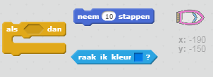
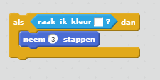
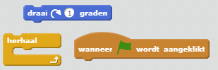
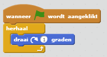

## Obstakels en bonussen

Op dit moment is dit spel *veel* te gemakkelijk - laten we dingen toevoegen om het interessanter te maken.

--- task ---

Laten we eerst wat 'versnellingen' aan je spel toevoegen om de boot sneller te laten gaan. Bewerk je toneelachtergrond en voeg enkele witte versnellingspijlen toe.

--- /task ---

--- task ---

Voeg nu een code aan je herhaal lus toe zodat de boot drie extra stappen verplaatst wanneer deze een witte versnellingspijl raakt.

--- hints --- --- hint --- `Als` je boot `de kleur wit raakt`, dan moet het `3 extra stappen maken`.  
--- /hint --- --- hint --- Dit zij de code blokken die je nodig hebt:  --- /hint --- --- hint --- Zo zou je code er moeten uitzien:  --- /hint --- --- /hints ---

--- /task ---

--- task ---

Je kunt ook een draaiende poort toevoegen die je boot moet vermijden. Voeg een nieuwe sprite toe genaamd 'poort' die er als volgt uitziet:

Zorg ervoor dat de kleur van de poort hetzelfde is als die van de houten hindernissen.

--- /task ---

--- task ---

Stel het midden van de poort sprite in.

--- /task ---

--- task ---

Voeg code aan je poort toe zodat deze met een herhaal blok langzaam ronddraait.

--- hints --- --- hint --- Voeg code aan de poort-sprite toe, zodat deze in een `herhaal` blok `1 graad draait`. --- /hint --- --- hint --- Dit zij de code blokken die je nodig hebt:  --- /hint --- --- hint --- Zo zou je code er moeten uitzien:  --- /hint --- --- /hints ---

--- /task ---

--- task ---

Test je spel. Je zou nu een draaiende poort moeten hebben die je moet vermijden.

--- /task ---